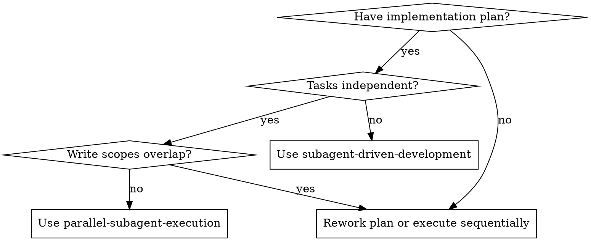

# Parallel Subagent Execution

Execute a written implementation plan by grouping safe tasks into parallel waves, dispatching one fresh subagent per task within each wave, then integrating and reviewing the combined result.

**Core principle:** Parallelize only when dependencies and write scopes are clear. When in doubt, keep the work sequential.

**Boundary:** This skill applies only after Parallel Subagents has been selected. If the selected mode is Inline Execution, use `superpowers:executing-plans`. If the selected mode is sequential Subagent-Driven execution, use `superpowers:subagent-driven-development`.

**Lane:** This workflow is Full Lane only. If the work is small and local, do not use parallel subagents.

**Isolation rule:** Each parallel task must run on its own dedicated branch and its own dedicated worktree. Do not share branches or worktrees across parallel implementers.

## When to Use

**Use when:**
- You already have a written implementation plan
- Some tasks have no sequential dependency on each other
- Each parallel task can have explicit file ownership
- Integration points are already defined in the plan
- Running tasks in waves will materially reduce overall time

**Do not use when:**
- Multiple tasks edit the same file or same tightly coupled module
- A shared interface or migration must land before other work
- The plan leaves ownership or ordering ambiguous
- Tasks require frequent back-and-forth coordination during implementation

## Review Boundaries

- Implementer self-review happens inside each task. It is a local quality check, not the workflow's formal review.
- Wave verification checks whether the integrated wave works after merge. It is not a formal review.
- Formal review means `superpowers:requesting-code-review` against the completed integrated result and runs once after all waves are integrated.
- Use `superpowers:receiving-code-review` only if that final formal review returns feedback that needs evaluation.

## Model Selection

Use the least powerful model that can handle each task safely. Parallel execution magnifies model selection mistakes because failures can multiply across a wave.

**Mechanical implementation tasks** (fixed interface, clear spec, 1-2 owned files): use a fast, cheap model.

**Moderate integration tasks** (multiple owned files, clear contract, normal verification burden): use a standard model.

**High-ambiguity tasks** (shared contracts, debugging, integration risk, ownership uncertainty): use the most capable available model, or remove the task from the parallel wave if the ambiguity is still high.

**Task complexity signals:**
- Fully specified task with explicit ownership and 1-2 files -> cheap model
- Multiple files but clear ownership and stable contract -> standard model
- Contract ambiguity, debugging, or high integration risk -> most capable model or sequential handling

Same wave can mix models by task. Do not force every task in a parallel wave onto the same model.

## Handling Implementer Status

Parallel implementers report one of four statuses. Handle each before integrating the wave:

**DONE:** Verify the task stayed within assigned scope, then integrate when the wave is ready.

**DONE_WITH_CONCERNS:** Read the concerns before integrating. If they involve correctness, interface contracts, ownership, or integration risk, resolve them before merging that task branch. If they are minor observations, record them and continue.

**NEEDS_CONTEXT:** Provide the missing context and re-dispatch. If the missing context changes a shared contract, pause the affected wave until every task has the updated contract.

**BLOCKED:** Do not force the wave forward blindly. Either provide more context, re-dispatch with a stronger model, split the task, move it to a later sequential wave, or escalate to the human if the plan itself is wrong.

Never ignore `DONE_WITH_CONCERNS`, `NEEDS_CONTEXT`, or `BLOCKED` when the concern touches correctness, scope, ownership, or integration.

## The Process

### Step 1: Load the Plan and Extract Task Data

Read the plan once. For each task, record:
- Full task text
- Files created, modified, and tested
- Dependencies on other tasks
- Integration risk

If the plan does not specify file paths clearly enough to reason about ownership, stop and resolve that before dispatching parallel work.

### Step 2: Build Parallel Waves

Partition tasks into waves. Tasks may be in the same wave only if:
- No task in the wave depends on another task in that wave
- Their write scopes do not overlap
- Their tests can run independently
- The controller can explain the interface contract up front

If a task is ambiguous, risky, or likely to conflict, move it into a later sequential wave.

### Step 3: Dispatch One Implementer Per Task in the Wave

Use `./implementer-prompt.md`.

Before dispatching the wave:
- Create one dedicated branch and one dedicated worktree per task
- Record which branch and worktree belong to which task
- Decide how each completed task branch will be reintegrated into the main implementation branch

`File ownership` means the assigned file scope for that task, not OS or user permissions.

Each subagent must receive:
- The full task text
- Scene-setting context
- Exact file ownership
- Any required interface contract
- Its assigned branch
- Its assigned worktree
- The rule that other subagents may be working in parallel

Do not make the subagent read the plan file itself. Provide exactly what it needs.

### Step 4: Wait, Verify, and Integrate the Wave

When subagents return:
- Read each status and summary
- Verify that no subagent wrote outside its assigned scope
- Resolve any integration mismatch before continuing
- Run targeted verification for the completed wave

Wave-level verification is not a formal review. It only proves the integrated wave still works before you continue.

Integration must be explicit:
- Reintegrate one completed task branch at a time into the main implementation branch
- Prefer cherry-pick, merge, or equivalent deliberate integration over copy-pasting changes by hand
- If two tasks turned out to have hidden coupling, stop and resolve that before integrating more work
- Re-run verification after the full wave is integrated on the main implementation branch

If any subagent reports `DONE_WITH_CONCERNS`, `BLOCKED`, or `NEEDS_CONTEXT`, resolve it before dispatching the next wave.

### Step 5: Continue Wave by Wave

Repeat the dispatch and integration cycle until all plan tasks are complete.

Do not start a new wave until the current wave has been integrated and verified.

### Step 6: Final Verification and Formal Review

After all waves complete:
- Run the relevant full test suite
- Invoke `superpowers:requesting-code-review` once against the completed integrated result
- If it returns findings, use `superpowers:receiving-code-review` and fix Important or Critical issues
- Use `superpowers:finishing-a-development-branch` only if the user explicitly requests an integration action

## Prompt Templates

- `./implementer-prompt.md` - Dispatch implementer subagents with explicit ownership and parallel-execution constraints

## Coordination Rules

**Controller responsibilities:**
- Decide whether a task is safe to parallelize
- Define file ownership before dispatch
- Provide interface contracts instead of letting subagents invent them
- Create dedicated execution branches/worktrees and reintegrate them safely
- Integrate and verify each wave before moving on

**Subagent responsibilities:**
- Stay within assigned scope
- Ask questions instead of guessing
- Report conflicts or missing context immediately
- Self-review before reporting back

## Red Flags

**Never:**
- Dispatch two implementation subagents that can edit the same file
- Parallelize tasks with unresolved dependency order
- Let subagents discover ownership on their own
- Let multiple implementers commit directly onto the same shared branch
- Ignore wave-level integration failures
- Skip final full-suite verification
- Treat wave-level verification as the workflow's final formal review
- Skip the final formal review of the completed integrated result

**If integration breaks after a wave:**
- Stop dispatching more work
- Fix or re-plan the interface mismatch
- Re-run verification before continuing

## Integration

**Required workflow skills:**
- **superpowers:using-git-worktrees** - REQUIRED: Set up isolated workspace before starting
- **superpowers:writing-plans** - Creates the plan this skill executes
- **superpowers:requesting-code-review** - REQUIRED: Final formal review of the completed integrated result
- **superpowers:receiving-code-review** - Use when the final formal review returns feedback that needs evaluation
- **superpowers:finishing-a-development-branch** - Use only if the user explicitly requests an integration action

**Subagents should use:**
- **superpowers:test-driven-development** - Subagents follow TDD for each task

**Alternative workflows:**
- **superpowers:subagent-driven-development** - Use when tasks are not safe to parallelize
- **superpowers:executing-plans** - Use when doing the work inline in the current session
