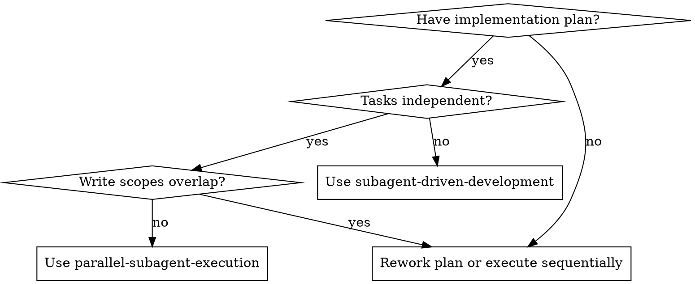

# Parallel Subagent Execution

Execute a written implementation plan by grouping safe tasks into parallel waves, dispatching one fresh subagent per task within each wave, then integrating and reviewing the combined result.

**Core principle:** Parallelize only when dependencies and write scopes are clear. When in doubt, keep the work sequential.

**Boundary:** This skill applies only after Parallel Subagents has been selected. If the selected mode is Inline Execution, use `superpowers:executing-plans`. If the selected mode is sequential Subagent-Driven execution, use `superpowers:subagent-driven-development`.

**Isolation rule:** Each parallel task must run on its own dedicated branch and its own dedicated worktree. Do not share branches or worktrees across parallel implementers.

## When to Use

**Use when:**
- You already have a written implementation plan
- Some tasks have no sequential dependency on each other
- Each parallel task can have explicit file ownership
- Integration points are already defined in the plan
- Running tasks in waves will materially reduce overall time

**Do not use when:**
- Multiple tasks edit the same file or same tightly coupled module
- A shared interface or migration must land before other work
- The plan leaves ownership or ordering ambiguous
- Tasks require frequent back-and-forth coordination during implementation

## The Process

### Step 1: Load the Plan and Extract Task Data

Read the plan once. For each task, record:
- Full task text
- Files created, modified, and tested
- Dependencies on other tasks
- Integration risk

If the plan does not specify file paths clearly enough to reason about ownership, stop and resolve that before dispatching parallel work.

### Step 2: Build Parallel Waves

Partition tasks into waves. Tasks may be in the same wave only if:
- No task in the wave depends on another task in that wave
- Their write scopes do not overlap
- Their tests can run independently
- The controller can explain the interface contract up front

If a task is ambiguous, risky, or likely to conflict, move it into a later sequential wave.

### Step 3: Dispatch One Implementer Per Task in the Wave

Use `./implementer-prompt.md`.

Before dispatching the wave:
- Create one dedicated branch and one dedicated worktree per task
- Record which branch and worktree belong to which task
- Decide how each completed task branch will be reintegrated into the main implementation branch

Each subagent must receive:
- The full task text
- Scene-setting context
- Exact file ownership
- Any required interface contract
- Its assigned branch
- Its assigned worktree
- The rule that other subagents may be working in parallel

Do not make the subagent read the plan file itself. Provide exactly what it needs.

### Step 4: Wait, Review, and Integrate the Wave

When subagents return:
- Read each status and summary
- Verify that no subagent wrote outside its assigned scope
- Resolve any integration mismatch before continuing
- Run targeted verification for the completed wave

Integration must be explicit:
- Reintegrate one completed task branch at a time into the main implementation branch
- Prefer cherry-pick, merge, or equivalent deliberate integration over copy-pasting changes by hand
- If two tasks turned out to have hidden coupling, stop and resolve that before integrating more work
- Re-run verification after the full wave is integrated on the main implementation branch

If any subagent reports `BLOCKED` or `NEEDS_CONTEXT`, stop and resolve it before dispatching the next wave.

### Step 5: Continue Wave by Wave

Repeat the dispatch and integration cycle until all plan tasks are complete.

Do not start a new wave until the current wave has been integrated and verified.

### Step 6: Final Verification and Review

After all waves complete:
- Run the relevant full test suite
- Invoke `superpowers:requesting-code-review`
- Fix Important or Critical issues
- Use `superpowers:finishing-a-development-branch` only if the user explicitly requests an integration action

## Prompt Templates

- `./implementer-prompt.md` - Dispatch implementer subagents with explicit ownership and parallel-execution constraints

## Coordination Rules

**Controller responsibilities:**
- Decide whether a task is safe to parallelize
- Define file ownership before dispatch
- Provide interface contracts instead of letting subagents invent them
- Create dedicated execution branches/worktrees and reintegrate them safely
- Integrate and verify each wave before moving on

**Subagent responsibilities:**
- Stay within assigned scope
- Ask questions instead of guessing
- Report conflicts or missing context immediately
- Self-review before reporting back

## Red Flags

**Never:**
- Dispatch two implementation subagents that can edit the same file
- Parallelize tasks with unresolved dependency order
- Let subagents discover ownership on their own
- Let multiple implementers commit directly onto the same shared branch
- Ignore wave-level integration failures
- Skip final full-suite verification
- Skip final code review

**If integration breaks after a wave:**
- Stop dispatching more work
- Fix or re-plan the interface mismatch
- Re-run verification before continuing

## Integration

**Required workflow skills:**
- **superpowers:using-git-worktrees** - REQUIRED: Set up isolated workspace before starting
- **superpowers:writing-plans** - Creates the plan this skill executes
- **superpowers:requesting-code-review** - Review the combined result after all waves complete
- **superpowers:finishing-a-development-branch** - Use only if the user explicitly requests an integration action

**Subagents should use:**
- **superpowers:test-driven-development** - Subagents follow TDD for each task

**Alternative workflows:**
- **superpowers:subagent-driven-development** - Use when tasks are not safe to parallelize
- **superpowers:executing-plans** - Use when doing the work inline in the current session
