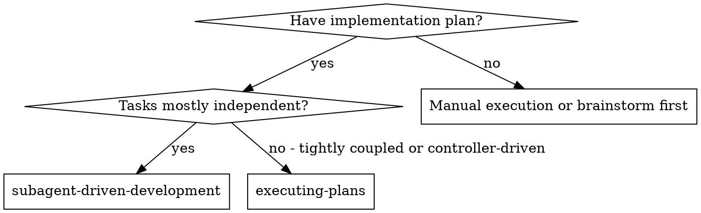
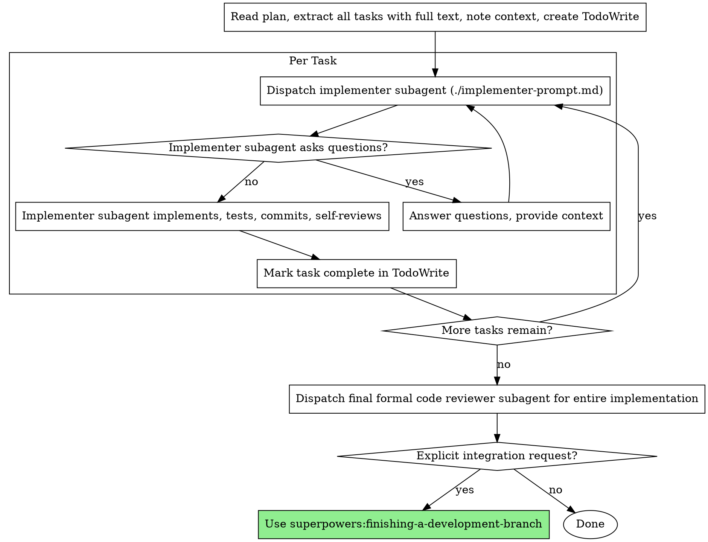

# Subagent-Driven Development

Execute a written implementation plan by dispatching a fresh subagent per task in sequence, then run one final formal review after the full implementation is complete.

**Boundary:** This skill applies only after Subagent-Driven execution has been selected. If the selected mode is Inline Execution, use `superpowers:executing-plans`. If the selected mode is Parallel Subagents, use `superpowers:parallel-subagent-execution`.

**Lane:** This workflow is Full Lane only. If the work is small and local, use main-agent inline execution instead.

**Core principle:** Fresh subagent per task + one final formal review at the end = fast iteration with one quality checkpoint

## Review Boundaries

- Implementer self-review happens inside each task. It is a local quality check, not the workflow's formal review.
- Do not dispatch routine per-task formal reviews in this workflow.
- Formal review means `superpowers:requesting-code-review` against the completed integrated result and runs once after all tasks are complete.
- Use `superpowers:receiving-code-review` only if that final formal review returns feedback that needs evaluation.

## When to Use



## The Process



## Model Selection

Use the least powerful model that can handle each role to conserve cost and increase speed.

**Mechanical implementation tasks** (isolated functions, clear specs, 1-2 files): use a fast, cheap model. Most implementation tasks are mechanical when the plan is well-specified.

**Integration and judgment tasks** (multi-file coordination, pattern matching, debugging): use a standard model.

**Architecture, design, and review tasks**: use the most capable available model.

**Task complexity signals:**
- Touches 1-2 files with a complete spec → cheap model
- Touches multiple files with integration concerns → standard model
- Requires design judgment or broad codebase understanding → most capable model

## Handling Implementer Status

Implementer subagents report one of four statuses. Handle each appropriately:

**DONE:** Move to the next task, or to final formal review if all tasks are complete.

**DONE_WITH_CONCERNS:** The implementer completed the work but flagged doubts. Read the concerns before proceeding. If the concerns are about correctness or scope, address them before moving on. If they're observations (e.g., "this file is getting large"), note them and proceed.

**NEEDS_CONTEXT:** The implementer needs information that wasn't provided. Provide the missing context and re-dispatch.

**BLOCKED:** The implementer cannot complete the task. Assess the blocker:
1. If it's a context problem, provide more context and re-dispatch with the same model
2. If the task requires more reasoning, re-dispatch with a more capable model
3. If the task is too large, break it into smaller pieces
4. If the plan itself is wrong, escalate to the human

**Never** ignore an escalation or force the same model to retry without changes. If the implementer said it's stuck, something needs to change.

## Prompt Templates

- `./implementer-prompt.md` - Dispatch implementer subagent

## Example Workflow

```
You: I'm using Subagent-Driven Development to execute this plan.

[Read plan file once: docs/superpowers/plans/feature-plan.md]
[Extract all 5 tasks with full text and context]
[Create TodoWrite with all tasks]

Task 1: Hook installation script

[Get Task 1 text and context (already extracted)]
[Dispatch implementation subagent with full task text + context]

Implementer: "Before I begin - should the hook be installed at user or system level?"

You: "User level (~/.config/superpowers/hooks/)"

Implementer: "Got it. Implementing now..."
[Later] Implementer:
  - Implemented install-hook command
  - Added tests, 5/5 passing
  - Self-review: Found I missed --force flag, added it
  - Committed

[Mark Task 1 complete]

Task 2: Recovery modes

[Get Task 2 text and context (already extracted)]
[Dispatch implementation subagent with full task text + context]

Implementer: [No questions, proceeds]
Implementer:
  - Added verify/repair modes
  - 8/8 tests passing
  - Self-review: All good
  - Committed

[Mark Task 2 complete]

...

[After all tasks]
[Get git SHAs, dispatch final formal code-reviewer]
Final reviewer: Strengths: Good coverage, clean implementation. Issues: None. Ready for the next requested integration step.

Done!
```

## Advantages

**vs. Manual execution:**
- Subagents follow TDD naturally
- Fresh context per task (no confusion)
- Parallel-safe (subagents don't interfere)
- Subagent can ask questions (before AND during work)

**vs. Executing Plans:**
- More task isolation
- More controller coordination overhead
- Stronger separation between implementation tasks

**Efficiency gains:**
- No file reading overhead (controller provides full text)
- Controller curates exactly what context is needed
- Subagent gets complete information upfront
- Questions surfaced before work begins (not after)

**Quality gates:**
- Self-review catches issues before handoff
- Final formal review catches cross-task issues before merge
- Implementer questions surface ambiguity before work starts

**Cost:**
- More subagent invocations than inline execution
- Controller does more prep work (extracting all tasks upfront)
- Fewer review interruptions during implementation
- Final formal review may find issues later, but iteration speed is higher

## Red Flags

**Never:**
- Start implementation on main/master branch without explicit user consent
- Skip verification entirely
- Proceed with unfixed issues
- Dispatch multiple implementation subagents in parallel in this workflow (use parallel-subagent-execution instead when the plan is safe for wave-based parallel work)
- Make subagent read plan file (provide full text instead)
- Skip scene-setting context (subagent needs to understand where task fits)
- Ignore subagent questions (answer before letting them proceed)
- Treat implementer self-review as the workflow's formal review
- Move to next task if the implementer flagged correctness doubts you have not addressed

**If subagent asks questions:**
- Answer clearly and completely
- Provide additional context if needed
- Don't rush them into implementation

**If final reviewer finds issues:**
- Fix the issues before any requested integration step
- Re-run final review if the issues are substantial
- Don't ignore merge-blocking feedback

**If subagent fails task:**
- Dispatch fix subagent with specific instructions
- Don't try to fix manually (context pollution)

## Integration

**Required workflow skills:**
- **superpowers:using-git-worktrees** - REQUIRED: Set up isolated workspace before starting
- **superpowers:writing-plans** - Creates the plan this skill executes
- **superpowers:requesting-code-review** - REQUIRED: Final formal review of the completed integrated result
- **superpowers:receiving-code-review** - Use when the final formal review returns feedback that needs evaluation
- **superpowers:finishing-a-development-branch** - Use only if the user explicitly requests an integration action

**Subagents should use:**
- **superpowers:test-driven-development** - Subagents follow TDD for each task

**Alternative workflows:**
- **superpowers:parallel-subagent-execution** - Use when the plan can be partitioned into independent, non-conflicting parallel waves
- **superpowers:executing-plans** - Use when the selected mode is main-agent direct inline execution
