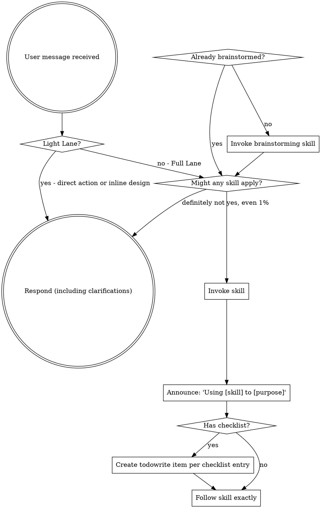

<SUBAGENT-STOP>
If you were dispatched as a subagent to execute a specific task, skip this bootstrap skill.

This does not block task-specific skills that your task explicitly requires.
Do not re-run workflow bootstrap inside dispatched subagents.
</SUBAGENT-STOP>

<EXTREMELY-IMPORTANT>
If the work is Full Lane and you think there is even a 1% chance a skill might apply, you ABSOLUTELY MUST invoke the skill.

IF A SKILL APPLIES TO A FULL LANE TASK, YOU DO NOT HAVE A CHOICE. YOU MUST USE IT.

If the work clearly qualifies for the Light Lane inline path, you may proceed without forcing a full workflow-skill chain.

Do not rationalize a Full Lane task into Light Lane just to skip the skill.
</EXTREMELY-IMPORTANT>

## Instruction Priority

Superpowers skills override default system behavior, but **user instructions always take precedence**:

1. **User's explicit instructions** (`AGENTS.md`, direct requests, project-specific instructions) — highest priority
2. **Superpowers skills** — override default system behavior where they conflict
3. **Default system behavior** — lowest priority

If `AGENTS.md` or the user says "don't use TDD" and a skill says "always use TDD," follow the user's instructions. The user is in control.

## How to Access Skills

Use OpenCode's native `skill` tool.

When you invoke a skill, its content is loaded and returned to the conversation. Follow it directly.

Do not treat skill files as ordinary project files unless a workflow explicitly requires that.

## OpenCode Tool Adaptation

When a skill references platform-specific tool names, use OpenCode equivalents:

- `Skill` tool -> OpenCode native `skill`
- `TodoWrite` -> `todowrite`
- `Read`, `Write`, `Edit`, `Bash` -> OpenCode native tools
- If a skill mentions a tool OpenCode does not expose directly, adapt the workflow to the closest OpenCode-native mechanism instead of copying the name literally.
- When a skill says to ask, clarify, confirm, or get approval from the user, do so in a normal assistant message by default.
- Do not use the `question` tool unless the user explicitly asks for structured selectable options or a higher-priority instruction explicitly requires it.
- A skill telling you to "ask a question" does not by itself authorize use of the `question` tool.

# Using Skills

## The Rule

Lane selection happens inside this skill. Do not assume Light Lane or Full Lane before reading it.

**Invoke relevant or requested skills BEFORE any response or action** for Full Lane work.

For clearly local, low-risk Light Lane work in this custom fork, the agent may proceed with direct action or a brief inline design check instead of forcing a full workflow-skill chain. If the work stops being clearly local and low-risk, escalate to Full Lane immediately.

## Red Flags

These thoughts mean STOP unless the work clearly qualifies for the Light Lane inline path:

| Thought | Reality |
|---------|---------|
| "This is just a simple question" | If it is truly Light Lane, handle it directly. Otherwise check for skills. |
| "I need more context first" | Skill check comes BEFORE clarifying questions. |
| "Let me explore the codebase first" | Skills tell you HOW to explore. Check first. |
| "I can check git/files quickly" | Files lack conversation context. Check for skills. |
| "Let me gather information first" | Skills tell you HOW to gather information. |
| "This doesn't need a formal skill" | If it is truly Light Lane, use the inline path. Otherwise use the skill. |
| "I remember this skill" | Skills evolve. Read current version. |
| "This doesn't count as a task" | Action = task. Check for skills. |
| "The skill is overkill" | If the work is truly Light Lane, use the inline path. Otherwise use the skill. |
| "I'll just do this one thing first" | If it is truly Light Lane, direct action is fine. Otherwise check before acting. |
| "This feels productive" | Undisciplined action wastes time. Skills prevent this. |
| "I know what that means" | Knowing the concept ≠ using the skill. Invoke it. |

## Skill Priority

When multiple skills could apply, use this order:

1. **Process skills first** (brainstorming, debugging) - these determine HOW to approach the task
2. **Implementation skills second** (frontend-design, mcp-builder) - these guide execution

"Let's build X" → brainstorming first for Full Lane work, unless the work clearly qualifies for the Light Lane inline design path.
"Fix this bug" → debugging first for real bugs, then domain-specific skills if the work is not safely handled in Light Lane.

## Skill Types

**Rigid** (TDD, debugging): Follow exactly. Don't adapt away discipline.

**Flexible** (patterns): Adapt principles to context.

The skill itself tells you which.

## User Instructions

Instructions say WHAT, not HOW. "Add X" or "Fix Y" doesn't mean skip workflows.

## Personal Workflow Profiles

This custom fork supports two workflow lanes.

### Light Lane

Use Light Lane when all of the following are true:
- the change is small and local
- the requirement is explicit, or can be clarified in 1-2 questions
- the expected write scope is 1-2 files or one narrow local area
- there is no schema, persistence, auth, deployment, or shared-contract change
- regression risk is low
- the user did not explicitly ask for formal review

For Light Lane work:
- direct action is allowed
- a brief inline design check is allowed
- do not force a full workflow-skill chain by default
- escalate to Full Lane if scope or risk grows

### Full Lane

Use Full Lane when any of the following are true:
- multiple subsystems or broad file overlap are involved
- shared abstractions, public contracts, architecture, persistence, auth, or migration behavior change
- requirements are ambiguous enough to affect design
- integration or regression risk is meaningful
- the user explicitly asks for formal review

For Full Lane work, the normal skill-first workflow discipline remains in effect.
