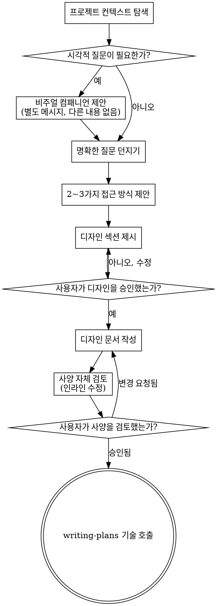

# 아이디어를 디자인으로 브레인스토밍하기

자연스러운 협업 대화를 통해 아이디어를 구체화된 디자인과 사양(spec)으로 전환하도록 돕습니다.

먼저 현재 프로젝트 컨텍스트를 이해한 다음, 아이디어를 정제하기 위해 질문을 하나씩 던집니다. 무엇을 만들지 이해했다면 디자인을 제시하고 사용자의 승인을 받으세요.

<HARD-GATE>
디자인을 제시하고 사용자가 이를 승인할 때까지 어떠한 구현 기술도 호출하지 말고, 코드를 작성하지도 말고, 프로젝트를 스캐폴딩하지도 말고, 어떠한 구현 작업도 수행하지 마세요. 이는 아무리 간단해 보이는 프로젝트라도 모든 프로젝트에 적용됩니다.
</HARD-GATE>

## 안티 패턴: "너무 간단해서 디자인이 필요 없다"

모든 프로젝트는 이 과정을 거쳐야 합니다. 할 일 목록(todo list), 단일 기능 유틸리티, 설정 변경 등 모든 것이 해당됩니다. "간단한" 프로젝트일수록 검토되지 않은 가정으로 인해 작업이 낭비될 가능성이 가장 높습니다. 디자인은 짧을 수 있지만(정말 간단한 프로젝트의 경우 몇 문장), 반드시 디자인을 제시하고 승인을 받아야 합니다.

## 체크리스트

다음 항목 각각에 대해 태스크를 생성하고 순서대로 완료해야 합니다:

1. **프로젝트 컨텍스트 탐색** — 파일, 문서, 최근 커밋 확인
2. **비주얼 컴패니언(Visual Companion) 제안** (시각적인 질문이 포함될 주제인 경우) — 이는 명확한 질문과 결합되지 않은 별도의 메시지여야 합니다. 아래의 비주얼 컴패니언 섹션을 참조하세요.
3. **명확한 질문 던지기** — 한 번에 하나씩, 목적/제약 조건/성공 기준 이해
4. **2~3가지 접근 방식 제안** — 각각의 장단점과 권장 사항 포함
5. **디자인 제시** — 복잡도에 따라 섹션별로 나누어 제시하고, 각 섹션이 끝날 때마다 사용자의 승인을 받음
6. **디자인 문서 작성** — `docs/superpowers/specs/YYYY-MM-DD-<topic>-design.md`에 저장하고 커밋
7. **사양(Spec) 자체 검토** — 플레이스홀더, 모순, 모호함, 범위에 대한 빠른 인라인 확인 (아래 참조)
8. **작성된 사양에 대한 사용자 검토** — 다음 단계로 진행하기 전에 사용에게 사양 파일을 검토하도록 요청
9. **구현으로 전환** — 구현 계획을 생성하기 위해 writing-plans 기술 호출

## 프로세스 흐름

**최종 상태는 writing-plans를 호출하는 것입니다.** frontend-design, mcp-builder 또는 기타 구현 기술을 호출하지 마세요. 브레인스토밍 후에 호출하는 유일한 기술은 writing-plans입니다.

## 프로세스

**아이디어 이해하기:**

- 먼저 현재 프로젝트 상태를 확인하세요 (파일, 문서, 최근 커밋).
- 세부 질문을 하기 전에 범위를 평가하세요. 요청이 여러 독립적인 하위 시스템(예: "채팅, 파일 저장소, 결제, 분석 기능이 있는 플랫폼 구축")을 설명하는 경우, 즉시 이를 알리세요. 먼저 분해해야 할 프로젝트의 세부 사항을 다듬느라 질문을 낭비하지 마세요.
- 프로젝트가 단일 사양으로 다루기에 너무 크다면 사용자가 하위 프로젝트로 분해하도록 돕습니다. 독립적인 조각은 무엇인지, 서로 어떤 관련이 있는지, 어떤 순서로 구축해야 하는지 등을 논의합니다. 그런 다음 일반적인 디자인 흐름에 따라 첫 번째 하위 프로젝트를 브레인스토밍합니다. 각 하위 프로젝트는 자체 사양 → 계획 → 구현 사이클을 가집니다.
- 적절한 범위의 프로젝트의 경우, 아이디어를 정제하기 위해 한 번에 하나씩 질문을 던집니다.
- 가능하면 객관식 질문을 선호하되, 주관식 질문도 괜찮습니다.
- 메시지당 하나의 질문만 하세요. 주제에 더 많은 탐구가 필요하다면 여러 질문으로 나눕니다.
- 목적, 제약 조건, 성공 기준을 이해하는 데 집중하세요.

**접근 방식 탐색:**

- 장단점이 포함된 2~3가지 서로 다른 접근 방식을 제안합니다.
- 권장 사항과 그 이유를 담아 대화하듯 옵션을 제시합니다.
- 권장하는 옵션을 먼저 제시하고 그 이유를 설명하세요.

**디자인 제시:**

- 무엇을 만들지 이해했다고 믿는다면 디자인을 제시하세요.
- 각 섹션의 규모를 복잡도에 맞게 조정합니다. 간단하면 몇 문장, 미묘한 차이가 있다면 200~300단어 정도로 작성합니다.
- 각 섹션을 마친 후 지금까지 내용이 맞는지 물어보세요.
- 아키텍처, 컴포넌트, 데이터 흐름, 오류 처리, 테스트 등을 다룹니다.
- 이해가 되지 않는 부분이 있다면 언제든지 돌아가서 명확히 할 준비를 하세요.

**격리 및 명확성을 위한 디자인:**

- 시스템을 하나의 명확한 목적을 가지고, 잘 정의된 인터페이스를 통해 통신하며, 독립적으로 이해되고 테스트될 수 있는 작은 단위로 나눕니다.
- 각 단위에 대해 "무엇을 하는가?", "어떻게 사용하는가?", "무엇에 의존하는가?"에 답할 수 있어야 합니다.
- 내부 코드를 읽지 않고도 해당 단위가 무엇을 하는지 이해할 수 있나요? 내부를 변경해도 사용하는 측에 영향을 주지 않나요? 그렇지 않다면 경계를 더 다듬어야 합니다.
- 경계가 잘 정의된 작은 단위는 작업하기에도 더 쉽습니다. 한 번에 컨텍스트로 파악할 수 있는 코드를 더 잘 추론할 수 있으며, 파일이 집중되어 있을 때 수정 작업이 더 안정적입니다. 파일이 커지면 종종 너무 많은 일을 하고 있다는 신호입니다.

**기존 코드베이스에서 작업하기:**

- 변경 사항을 제안하기 전에 현재 구조를 탐색하세요. 기존 패턴을 따릅니다.
- 기존 코드에 작업에 영향을 미치는 문제(예: 너무 커진 파일, 불명확한 경계, 엉킨 책임 등)가 있는 경우, 좋은 개발자가 작업 중인 코드를 개선하는 것처럼 디자인의 일부로 타겟팅된 개선 사항을 포함하세요.
- 관련 없는 리팩토링을 제안하지 마세요. 현재 목표에 도움이 되는 것에 집중하세요.

## 디자인 이후

**문서화:**

- 검증된 디자인(사양)을 `docs/superpowers/specs/YYYY-MM-DD-<topic>-design.md`에 작성합니다.
  - (사양 위치에 대한 사용자 기본 설정이 있는 경우 이 기본값보다 우선합니다.)
- 사용 가능한 경우 elements-of-style:writing-clearly-and-concisely 기술을 사용하세요.
- 디자인 문서를 git에 커밋합니다.

**사양 자체 검토:**
사양 문서를 작성한 후 새로운 관점에서 살펴보세요:

1. **플레이스홀더 스캔:** "TBD", "TODO", 미완성 섹션 또는 모호한 요구 사항이 있나요? 수정하세요.
2. **내부 일관성:** 섹션끼리 서로 모순되는 부분이 있나요? 아키텍처가 기능 설명과 일치하나요?
3. **범위 확인:** 단일 구현 계획으로 다루기에 충분히 집중되어 있나요? 아니면 분해가 필요한가요?
4. **모호성 확인:** 요구 사항이 두 가지 이상의 방식으로 해석될 수 있나요? 그렇다면 하나를 선택하고 명시적으로 만드세요.

문제가 있다면 즉시 수정하세요. 다시 검토할 필요는 없습니다. 수정하고 다음으로 넘어가세요.

**사용자 검토 관문:**
사양 검토 루프가 통과되면 다음 단계로 진행하기 전에 사용자에게 작성된 사양을 검토하도록 요청하세요:

> "사양이 작성되어 `<경로>`에 커밋되었습니다. 검토해 주시고 구현 계획을 작성하기 전에 변경하고 싶은 부분이 있는지 알려주세요."

사용자의 응답을 기다립니다. 변경을 요청하면 수정하고 사양 검토 루프를 다시 실행합니다. 사용자가 승인한 후에만 진행하세요.

**구현:**

- 상세한 구현 계획을 생성하기 위해 writing-plans 기술을 호출합니다.
- 다른 기술을 호출하지 마세요. writing-plans가 다음 단계입니다.

## 핵심 원칙

- **한 번에 한 질문씩** - 여러 질문으로 부담을 주지 마세요.
- **객관식 선호** - 가능하면 주관식보다 대답하기 쉽습니다.
- **철저한 YAGNI** - 모든 디자인에서 불필요한 기능은 제거하세요.
- **대안 탐색** - 결정하기 전에 항상 2~3가지 접근 방식을 제안하세요.
- **점진적 검증** - 디자인을 제시하고 승인을 받은 후 다음으로 넘어가세요.
- **유연성** - 이해가 되지 않는 부분이 있다면 돌아가서 명확히 하세요.

## 비주얼 컴패니언 (Visual Companion)

브레인스토밍 중에 목업, 다이어그램, 시각적 옵션을 보여주기 위한 브라우저 기반 컴패니언입니다. 모드가 아닌 도구로 제공됩니다. 컴패니언을 수락한다는 것은 시각적 처리가 필요한 질문에 사용할 수 있다는 의미이지, 모든 질문을 브라우저를 통해 처리한다는 의미는 아닙니다.

**컴패니언 제안:** 앞으로의 질문에 시각적 콘텐츠(목업, 레이아웃, 다이어그램)가 포함될 것으로 예상되면 동의를 위해 한 번 제안하세요:
> "우리가 작업 중인 내용 중 일부는 웹 브라우저에서 보여드리면 설명하기 더 쉬울 수 있습니다. 진행하면서 목업, 다이어그램, 비교 및 기타 시각 자료를 준비할 수 있습니다. 이 기능은 아직 초기 단계이며 토큰 사용량이 많을 수 있습니다. 사용해 보시겠습니까? (로컬 URL을 열어야 합니다.)"

**이 제안은 반드시 별도의 메시지로 전달되어야 합니다.** 명확한 질문, 컨텍스트 요약 또는 다른 내용과 결합하지 마세요. 메시지에는 위의 제안 내용만 포함되어야 하며 다른 내용은 없어야 합니다. 계속하기 전에 사용자의 응답을 기다리세요. 거부하면 텍스트 전용 브레인스토밍을 진행합니다.

**질문별 결정:** 사용자가 수락한 후에도 **각 질문**에 대해 브라우저를 사용할지 터미널을 사용할지 결정하세요. 기준은: **사용자가 읽는 것보다 보는 것이 더 잘 이해되는가?** 입니다.

- 레이아웃 비교, 아키텍처 다이어그램, 나란히 배치된 시각적 디자인 등 콘텐츠 자체가 시각적인 경우 **브라우저를 사용**하세요.
- 요구 사항 질문, 개념적 선택, 장단점 목록, A/B/C/D 텍스트 옵션, 범위 결정 등 콘텐츠가 텍스트인 경우 **터미널을 사용**하세요.

UI 주제에 대한 질문이라고 해서 자동으로 시각적인 질문은 아닙니다. "이 맥락에서 개성(personality)은 무엇을 의미하나요?"는 개념적인 질문이므로 터미널을 사용합니다. "어떤 마법사(wizard) 레이아웃이 더 나은가요?"는 시각적인 질문이므로 브라우저를 사용합니다.

컴패니언 사용에 동의하면 진행하기 전에 상세 가이드를 읽으세요:
`skills/brainstorming/visual-companion.md`
