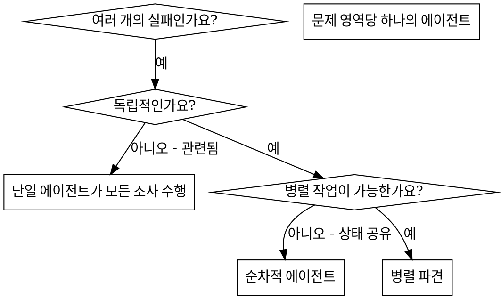

# 병렬 에이전트 파견 (Dispatching Parallel Agents)

## 개요

문맥이 분리된 전문화된 에이전트에게 작업을 위임합니다. 지침과 문맥을 정밀하게 구성하여 에이전트가 작업에 집중하고 성공할 수 있도록 합니다. 에이전트는 현재 세션의 문맥이나 히스토리를 그대로 상속받아서는 안 됩니다. 에이전트에게 필요한 것만 정확하게 구성해서 제공해야 합니다. 이는 여러분 자신의 코디네이션 작업을 위한 문맥을 보존하는 데에도 도움이 됩니다.

여러 개의 서로 관련 없는 실패(다른 테스트 파일, 다른 하위 시스템, 다른 버그)가 발생했을 때, 이를 순차적으로 조사하는 것은 시간 낭비입니다. 각 조사는 독립적이며 병렬로 진행될 수 있습니다.

**핵심 원칙:** 독립적인 문제 영역당 하나의 에이전트를 파견하십시오. 에이전트들이 동시에 작업하게 하십시오.

## 사용 시기



**사용하는 경우:**
- 서로 다른 근본 원인을 가진 3개 이상의 테스트 파일 실패
- 독립적으로 고장난 여러 하위 시스템
- 다른 문제의 문맥 없이도 각 문제를 이해할 수 있는 경우
- 조사 간에 공유되는 상태가 없는 경우

**사용하지 않는 경우:**
- 실패 원인이 서로 관련되어 있는 경우 (하나를 고치면 다른 것도 고쳐질 수 있는 경우)
- 전체 시스템 상태를 이해해야 하는 경우
- 에이전트들이 서로 간섭할 수 있는 경우

## 패턴

### 1. 독립적인 영역 식별

무엇이 고장났는지에 따라 실패를 그룹화합니다:
- 파일 A 테스트: 도구 승인 흐름
- 파일 B 테스트: 배치 완료 동작
- 파일 C 테스트: 중단(Abort) 기능

각 영역은 독립적입니다. 도구 승인을 고쳐도 중단 테스트에는 영향을 주지 않습니다.

### 2. 집중된 에이전트 작업 생성

각 에이전트에게 다음을 제공합니다:
- **구체적인 범위:** 하나의 테스트 파일 또는 하위 시스템
- **명확한 목표:** 해당 테스트를 통과시킬 것
- **제약 사항:** 다른 코드를 변경하지 말 것
- **예상 출력:** 발견하고 수정한 내용의 요약

### 3. 병렬 파견

```typescript
// Claude Code / AI 환경에서
Task("agent-tool-abort.test.ts 실패 수정")
Task("batch-completion-behavior.test.ts 실패 수정")
Task("tool-approval-race-conditions.test.ts 실패 수정")
// 세 작업이 동시에 실행됨
```

### 4. 검토 및 통합

에이전트가 복귀하면:
- 각 요약을 읽습니다.
- 수정 사항이 충돌하지 않는지 확인합니다.
- 전체 테스트 스위트를 실행합니다.
- 모든 변경 사항을 통합합니다.

## 에이전트 프롬프트 구조

좋은 에이전트 프롬프트의 특징:
1. **집중됨** - 하나의 명확한 문제 영역
2. **자립적** - 문제를 이해하는 데 필요한 모든 문맥 포함
3. **구체적인 출력** - 에이전트가 무엇을 반환해야 하는지 명시

```markdown
src/agents/agent-tool-abort.test.ts에서 실패하는 3개의 테스트를 수정하십시오:

1. "should abort tool with partial output capture" - 메시지에 'interrupted at'이 포함될 것을 기대함
2. "should handle mixed completed and aborted tools" - 완료 대신 중단된 빠른 도구 처리
3. "should properly track pendingToolCount" - 3개의 결과를 기대하지만 0개를 받음

이것들은 타이밍/경합 조건(race condition) 문제입니다. 여러분의 작업:

1. 테스트 파일을 읽고 각 테스트가 무엇을 검증하는지 이해하십시오.
2. 근본 원인을 파악하십시오 - 타이밍 문제인가요, 아니면 실제 버그인가요?
3. 다음 방법으로 수정하십시오:
   - 임의의 타임아웃을 이벤트 기반 대기로 교체
   - 중단(abort) 구현에서 발견된 버그 수정
   - 동작 변경에 따른 테스트 기대값 조정

단순히 타임아웃 시간을 늘리지 마십시오 - 실제 원인을 찾으십시오.

반환: 발견한 내용과 수정한 내용의 요약.
```

## 흔한 실수

**❌ 너무 광범위함:** "모든 테스트를 수정하십시오" - 에이전트가 길을 잃음
**✅ 구체적임:** "agent-tool-abort.test.ts를 수정하십시오" - 집중된 범위

**❌ 문맥 없음:** "경합 조건을 수정하십시오" - 에이전트가 어디인지 모름
**✅ 문맥 제공:** 에러 메시지와 테스트 이름을 붙여넣기

**❌ 제약 사항 없음:** 에이전트가 모든 것을 리팩토링할 수 있음
**✅ 제약 사항 제공:** "프로덕션 코드를 변경하지 마십시오" 또는 "테스트만 수정하십시오"

**❌ 모호한 출력:** "수정하십시오" - 무엇이 바뀌었는지 알 수 없음
**✅ 구체적임:** "근본 원인과 변경 사항의 요약을 반환하십시오"

## 사용하지 말아야 할 때

**관련된 실패:** 하나를 고치면 다른 것도 고쳐질 수 있는 경우 - 먼저 함께 조사하십시오.
**전체 문맥 필요:** 전체 시스템을 봐야만 이해할 수 있는 경우
**탐색적 디버깅:** 아직 무엇이 고장났는지 모르는 경우
**공유 상태:** 에이전트들이 서로 간섭할 수 있는 경우 (동일한 파일 편집, 동일한 리소스 사용)

## 실제 세션 사례

**시나리오:** 대규모 리팩토링 후 3개 파일에서 6개의 테스트 실패 발생

**실패 내용:**
- agent-tool-abort.test.ts: 3개 실패 (타이밍 문제)
- batch-completion-behavior.test.ts: 2개 실패 (도구 실행 안 됨)
- tool-approval-race-conditions.test.ts: 1개 실패 (실행 횟수 = 0)

**결정:** 독립적인 영역 - 중단 로직, 배치 완료, 경합 조건은 서로 분리됨

**파견:**
```
에이전트 1 → agent-tool-abort.test.ts 수정
에이전트 2 → batch-completion-behavior.test.ts 수정
에이전트 3 → tool-approval-race-conditions.test.ts 수정
```

**결과:**
- 에이전트 1: 타임아웃을 이벤트 기반 대기로 교체
- 에이전트 2: 이벤트 구조 버그 수정 (threadId 위치 오류)
- 에이전트 3: 비동기 도구 실행 완료 대기 추가

**통합:** 모든 수정 사항이 독립적이고 충돌이 없었으며, 전체 테스트 통과

**절약된 시간:** 3개의 문제를 순차적이 아닌 병렬로 해결

## 주요 이점

1. **병렬화** - 여러 조사가 동시에 발생
2. **집중** - 각 에이전트의 범위가 좁아 추적할 문맥이 적음
3. **독립성** - 에이전트들이 서로 간섭하지 않음
4. **속도** - 1개 해결할 시간에 3개 해결

## 검증

에이전트가 복귀하면:
1. **각 요약 검토** - 무엇이 변했는지 이해
2. **충돌 확인** - 에이전트들이 동일한 코드를 편집했는가?
3. **전체 스위트 실행** - 모든 수정 사항이 함께 잘 작동하는지 확인
4. **부분 점검(Spot check)** - 에이전트가 체계적인 오류를 범할 수 있음

## 실제 세계 영향

디버깅 세션 (2025-10-03) 결과:
- 3개 파일에 걸친 6개 실패
- 3명의 에이전트 병렬 파견
- 모든 조사 동시 완료
- 모든 수정 사항 성공적 통합
- 에이전트 변경 사항 간 충돌 없음
