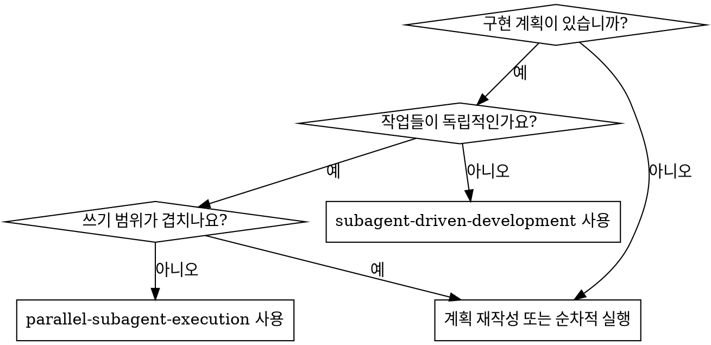

# 병렬 서브에이전트 실행 (Parallel Subagent Execution)

안전한 작업들을 병렬 웨이브로 그룹화하고, 각 웨이브 내의 작업당 하나의 신선한 서브에이전트를 파견한 후, 결합된 결과를 통합하고 리뷰하여 서면 구현 계획을 실행합니다.

**핵심 원칙:** 의존성과 쓰기 범위(write scope)가 명확할 때만 병렬화하십시오. 의심스러울 때는 작업을 순차적으로 진행하십시오.

**격리 규칙:** 각 병렬 작업은 반드시 자체 전용 브랜치와 전용 작업트리(worktree)에서 실행되어야 합니다. 병렬 구현자 간에 브랜치나 작업트리를 공유하지 마십시오.

## 사용 시기

**사용 시기:**
- 이미 서면 구현 계획이 있는 경우
- 일부 작업들이 서로 순차적인 의존성이 없는 경우
- 각 병렬 작업에 대해 명시적인 파일 소유권(ownership)을 부여할 수 있는 경우
- 통합 지점(integration points)이 계획에 이미 정의되어 있는 경우
- 작업을 웨이브 단위로 실행하는 것이 전체 시간을 실질적으로 단축할 수 있는 경우

**사용 금지:**
- 여러 작업이 동일한 파일 또는 밀접하게 결합된 동일한 모듈을 수정하는 경우
- 공유 인터페이스나 마이그레이션이 다른 작업보다 먼저 완료되어야 하는 경우
- 계획에서 소유권이나 순서가 모호한 경우
- 구현 중에 작업 간에 잦은 상호 조정이 필요한 경우

## 프로세스

### 1단계: 계획 로드 및 작업 데이터 추출

계획을 한 번 읽습니다. 각 작업에 대해 다음을 기록하십시오:
- 전체 작업 텍스트
- 생성, 수정 및 테스트 대상 파일
- 다른 작업에 대한 의존성
- 통합 리스크

계획에서 소유권을 판단할 수 있을 만큼 파일 경로를 명확하게 지정하지 않았다면, 병렬 작업을 파견하기 전에 이를 해결하십시오.

### 2단계: 병렬 웨이브(Wave) 빌드

작업을 웨이브로 나눕니다. 다음 조건이 모두 충족될 때만 동일한 웨이브에 포함될 수 있습니다:
- 웨이브 내의 어떤 작업도 해당 웨이브 내의 다른 작업에 의존하지 않음
- 쓰기 범위가 서로 겹치지 않음
- 테스트를 독립적으로 실행할 수 있음
- 컨트롤러(여러분)가 인터페이스 계약(contract)을 사전에 설명할 수 있음

작업이 모호하거나 리스크가 있거나 충돌 가능성이 높은 경우, 나중의 순차적 웨이브로 이동시키십시오.

### 3단계: 웨이브 내 작업당 하나의 구현자 파견

`./implementer-prompt.md`를 사용하십시오.

웨이브를 파견하기 전에:
- 작업당 하나의 전용 브랜치와 전용 작업트리를 생성하십시오.
- 어떤 브랜치와 작업트리가 어떤 작업에 속하는지 기록하십시오.
- 완료된 각 작업 브랜치를 메인 구현 브랜치에 어떻게 재통합할지 결정하십시오.

각 서브에이전트는 다음을 받아야 합니다:
- 전체 작업 텍스트
- 상황 설정 문맥 (Context)
- 정확한 파일 소유권
- 필요한 모든 인터페이스 계약
- 할당된 브랜치
- 할당된 작업트리
- 다른 서브에이전트들이 병렬로 작업 중일 수 있다는 규칙

서브에이전트가 계획 파일 자체를 읽게 하지 마십시오. 필요한 것만 정확하게 제공하십시오.

### 4단계: 대기, 리뷰 및 웨이브 통합

서브에이전트가 복귀하면:
- 각 상태와 요약을 읽습니다.
- 서브에이전트가 할당된 범위 밖의 파일을 작성하지 않았는지 확인하십시오.
- 계속 진행하기 전에 통합 불일치 문제를 해결하십시오.
- 완료된 웨이브에 대해 대상 검증(targeted verification)을 실행하십시오.

통합은 명시적이어야 합니다:
- 완료된 작업 브랜치를 한 번에 하나씩 메인 구현 브랜치에 재통합하십시오.
- 변경 사항을 수동으로 복사-붙여넣기 하는 대신 cherry-pick, merge 또는 그에 상응하는 의도적인 통합 방식을 선호하십시오.
- 두 작업 사이에 숨겨진 결합이 있는 것으로 밝혀지면, 더 이상의 통합을 멈추고 문제를 해결하십시오.
- 메인 구현 브랜치에 전체 웨이브가 통합된 후 다시 검증을 실행하십시오.

서브에이전트가 `BLOCKED` 또는 `NEEDS_CONTEXT`를 보고하면, 다음 웨이브를 파견하기 전에 이를 멈추고 해결하십시오.

### 5단계: 웨이브별로 계속 진행

모든 계획 작업이 완료될 때까지 파견 및 통합 사이클을 반복하십시오.

현재 웨이브가 통합되고 검증될 때까지 새로운 웨이브를 시작하지 마십시오.

### 6단계: 최종 검증 및 리뷰

모든 웨이브가 완료된 후:
- 관련 전체 테스트 스위트를 실행하십시오.
- `superpowers:requesting-code-review`를 호출하십시오.
- 중요(Important) 또는 치명적(Critical) 이슈를 수정하십시오.
- `superpowers:finishing-a-development-branch`를 사용하십시오.

## 프롬프트 템플릿

- `./implementer-prompt.md` - 명시적인 소유권과 병렬 실행 제약 조건을 가진 구현자 서브에이전트 파견

## 조정 규칙 (Coordination Rules)

**컨트롤러(여러분의) 책임:**
- 작업이 병렬화하기 안전한지 결정
- 파견 전 파일 소유권 정의
- 서브에이전트가 스스로 만들게 하는 대신 인터페이스 계약 제공
- 전용 실행 브랜치/작업트리 생성 및 안전한 재통합
- 다음 단계로 넘어가기 전 각 웨이브 통합 및 검증

**서브에이전트 책임:**
- 할당된 범위 내 유지
- 추측 대신 질문하기
- 충돌 또는 문맥 누락 즉시 보고
- 보고 전 자체 검토 수행

## 주의 신호 (Red Flags)

**절대 금지:**
- 동일한 파일을 수정할 수 있는 두 명의 구현 서브에이전트 파견
- 해결되지 않은 의존성 순서가 있는 작업 병렬화
- 서브에이전트가 스스로 소유권을 발견하게 함
- 여러 구현자가 동일한 공유 브랜치에 직접 커밋하게 함
- 웨이브 수준의 통합 실패 무시
- 최종 전체 스위트 검증 건너뛰기
- 최종 코드 리뷰 건너뛰기

**웨이브 후 통합이 깨지는 경우:**
- 추가 작업 파견 중단
- 인터페이스 불일치 수정 또는 계획 재수립
- 계속 진행하기 전에 다시 검증 실행

## 통합

**필수 워크플로우 기술:**
- **superpowers:using-git-worktrees** - 필수: 시작 전 격리된 작업 공간 설정
- **superpowers:writing-plans** - 이 기술이 실행할 계획 생성
- **superpowers:requesting-code-review** - 모든 웨이브 완료 후 결합된 결과 리뷰
- **superpowers:finishing-a-development-branch** - 리뷰 후 개발 완료

**서브에이전트가 사용해야 할 기술:**
- **superpowers:test-driven-development** - 서브에이전트는 각 작업에 대해 TDD를 따름

**대안 워크플로우:**
- **superpowers:subagent-driven-development** - 작업들이 병렬화하기에 안전하지 않을 때 사용
- **superpowers:executing-plans** - 현재 세션에서 인라인으로 작업을 수행할 때 사용
