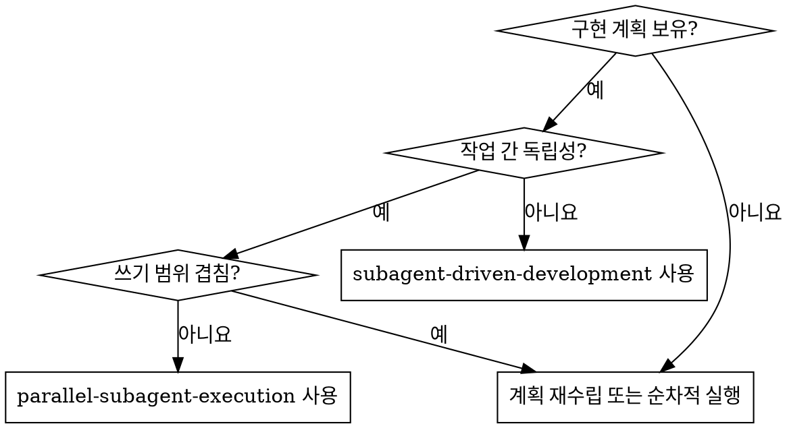

# 병렬 하위 에이전트 실행 (Parallel Subagent Execution)

안전한 작업들을 병렬 웨이브로 그룹화하여 각 작업당 새로운 하위 에이전트를 파견한 뒤, 그 결과를 통합하고 리뷰하는 방식으로 구현 계획을 실행합니다.

**코어 원칙:** 종속성과 쓰기 범위(write scopes)가 명확할 때만 병렬화하십시오. 확신이 서지 않을 때는 순차적으로 작업을 진행하십시오.

**경계:** 이 기술은 '병렬 하위 에이전트(Parallel Subagents)'가 선택되었을 때만 적용됩니다. 선택된 모드가 '인라인 실행(Inline Execution)'인 경우 `superpowers:executing-plans`를 사용하십시오. 선택된 모드가 매 단계마다 순차적으로 실행되는 '하위 에이전트 기반(Subagent-Driven)' 실행인 경우 `superpowers:subagent-driven-development`를 사용하십시오.

**격리 규칙 (Isolation rule):** 각 병렬 작업은 고유의 전용 브랜치와 전용 작업트리(worktree)에서 실행되어야 합니다. 병렬 구현자들 간에 브랜치나 작업트리를 절대 공유하지 마십시오.

## 언제 사용해야 하는가 (When to Use)

**사용해야 하는 경우:**
- 사전에 쓰인 구현 계획이 있는 경우
- 일부 작업들이 서로 순차적인 종속성을 갖지 않는 경우
- 각 병렬 작업이 명시적인 파일 소유권을 가질 수 있는 경우
- 통합 지점(Integration points)이 계획에 이미 정의된 경우
- 작업을 여러 웨이브로 실행함으로써 전체 소요 시간을 의미 있게 줄일 수 있는 경우

**사용하지 말아야 하는 경우:**
- 여러 작업이 동일한 파일이나 강하게 결합된 모듈을 같이 수정하는 경우
- 공유 인터페이스나 마이그레이션이 다른 작업보다 먼저 완료되어 적용되어야 하는 경우
- 계획상 파일 소유권이나 작업 순서가 모호한 경우
- 구현 중에 작업 간에 빈번한 의견 조율이나 상호 작용이 요구되는 경우

## 리뷰 경계 (Review Boundaries)

- 구현자 자체 검토(Implementer self-review)는 각 작업 내부에서 일어납니다. 이는 로컬 품질 검사이며 워크플로우의 공식 리뷰가 아닙니다.
- 웨이브 검증(Wave verification)은 통합(integrated)된 웨이브가 머지 후 작동하는지 확인합니다. 이는 공식 리뷰가 아닙니다.
- 공식 리뷰(Formal review)는 완료된 전체 통합 결과물에 대해 `superpowers:requesting-code-review`를 호출하는 것을 의미하며, 모든 웨이브가 통합된 후 한 번 실행됩니다.
- `superpowers:receiving-code-review`는 최종 공식 리뷰에서 검토가 필요한 피드백을 반환할 때에만 사용하십시오.

## 모델 선택 (Model Selection)

각 작업을 안전하게 처리할 수 있는 가장 가벼운(최소한의 강력함을 가진) 모델을 사용하십시오. 병렬 실행에서는 웨이브 전체에 걸쳐 실패가 증폭될 수 있으므로 모델 선택 실수의 영향이 큽니다.

**기계적인 구현 작업** (고정된 인터페이스, 명확한 스펙, 1-2개의 소유 파일): 빠르고 저렴한 모델을 사용하십시오.

**중간 수준의 통합 작업** (여러 소유 파일, 명확한 계약(contract), 일반적인 검증 부담): 표준 모델을 사용하십시오.

**모호성이 높은 작업** (공유 계약, 디버깅, 통합 리스크, 소유권 불확실성): 가용 가능한 가장 뛰어난 모델을 사용하거나, 모호성이 여전히 높다면 해당 작업을 병렬 웨이브에서 제외하십시오.

**작업 복잡성 판단 기준:**
- 명시적 소유권과 1-2개의 파일이 있는 완전히 스펙이 정의된 작업 -> 저렴한 모델
- 여러 파일이지만 소유권이 명확하고 계약이 안정적인 작업 -> 표준 모델
- 계약(contract) 모호성, 디버깅 또는 높은 통합 리스크 -> 가장 뛰어난 모델 또는 순차적 처리

같은 웨이브 내에서 작업별로 다른 모델을 섞어 쓸 수 있습니다. 병렬 웨이브의 모든 작업을 같은 모델에 강제로 할당하지 마십시오.

## 구현자 상태 처리 (Handling Implementer Status)

병렬 구현자는 네 가지 상태 중 하나를 보고합니다. 웨이브를 통합하기 전에 각각을 처리하십시오:

**완료 (DONE):** 작업이 할당된 범위를 벗어나지 않았는지 검증한 후, 웨이브가 준비되면 통합하십시오.

**우려사항이 있는 완료 (DONE_WITH_CONCERNS):** 통합하기 전에 우려사항을 읽어보십시오. 만약 정확성, 인터페이스 계약, 소유권 또는 통합 리스크와 관련이 있다면, 해당 작업 브랜치를 머지하기 전에 해결하십시오. 단순한 관찰이라면 기록만 하고 계속 진행하십시오.

**컨텍스트 필요 (NEEDS_CONTEXT):** 누락된 컨텍스트를 제공하고 다시 파견하십시오. 누락된 컨텍스트가 공유 계약(shared contract)을 변경하는 경우, 모든 작업이 업데이트된 계약을 전달받을 때까지 해당 웨이브를 일시 중지하십시오.

**차단됨 (BLOCKED):** 억지로 웨이브를 진행시키지 마십시오. 더 많은 컨텍스트를 제공하거나, 더 강력한 모델로 다시 파견하거나, 작업을 분할하거나, 이후의 순차적 웨이브로 옮기거나, 계획 자체가 잘못된 경우 사용자인 사람(Human)에게 문제를 제기(escalate)하십시오.

정확성, 범위, 소유권 또는 통합과 관련된 문제가 있을 때 `DONE_WITH_CONCERNS`, `NEEDS_CONTEXT`, `BLOCKED` 상태를 절대 무시하지 마십시오.

## 프로세스 (The Process)

### 1단계: 계획 로드 및 작업 데이터 추출 (Load the Plan and Extract Task Data)

계획을 한 번 읽습니다. 각 작업에 대해 다음을 기록하십시오:
- 전체 작업 텍스트
- 생성, 수정 및 테스트되는 파일들
- 다른 작업에 대한 종속성
- 통합 위험도(Integration risk)

만약 계획이 소유권을 따질 수 있을 만큼 파일 경로를 명확히 명시하지 않고 있다면, 즉시 멈추고 병렬 작업을 파견하기 전에 그 부분부터 해결하십시오.

### 2단계: 병렬 웨이브 구성 (Build Parallel Waves)

작업들을 웨이브로 파티셔닝합니다. 작업들은 다음의 조건들을 충족할 때만 같은 웨이브에 포함될 수 있습니다:
- 웨이브 내의 어떤 작업도 해당 웨이브 안의 다른 작업에 종속되지 않아야 합니다.
- 여러 작업들의 쓰기 범위(write scopes)가 겹치지 않아야 합니다.
- 여러 작업들의 테스트를 독립적으로 실행할 수 있어야 합니다.
- 컨트롤러가 사전에 인터페이스 계약의 내용을 설명할 수 있어야 합니다.

작업이 모호하거나 리스크가 크거나 충돌 가능성이 있다면, 그 작업을 나중에 진행될 순차적인 웨이브로 미루십시오.

### 3단계: 웨이브 내 작업당 하나의 구현자 파견 (Dispatch One Implementer Per Task in the Wave)

`./implementer-prompt.md`를 사용합니다.

웨이브 파견 전:
- 작업 1개 당 1개의 전용 브랜치와 전용 작업트리(worktree)를 만드십시오.
- 어떤 브랜치와 작업트리가 어떤 작업에 속하는지 기록해 두십시오.
- 완료된 각각의 작업 브랜치를 나중에 어떻게 메인 구현 브랜치에 재통합할지 결정하십시오.

`파일 소유권(File ownership)`은 운영 체제나 사용자의 권한이 아니라, 해당 작업을 위해 할당된 파일 범위를 의미합니다.

각 하위 에이전트는 다음 사항을 반드시 전달받아야 합니다:
- 전체 작업 텍스트
- 상황을 파악할 수 있는 컨텍스트 (Scene-setting context)
- 정확한 파일 소유권
- 필요한 필수 인터페이스 계약
- 본인에게 할당된 브랜치
- 본인에게 할당된 작업트리
- 다른 하위 에이전트들이 현재 자신과 병렬로 작업 중일 수 있다는 규칙

하위 에이전트에게 계획 파일 자체를 통째로 읽게 시키지 마십시오. 필요한 내용만 정확히 짚어서 제공하십시오.

### 4단계: 대기, 검증 및 웨이브 통합 (Wait, Verify, and Integrate the Wave)

하위 에이전트들이 복귀하면:
- 각 상태와 요약 내용을 확인합니다.
- 하위 에이전트가 본인에게 할당된 범위를 벗어난 곳에 작성하진 않았는지 검증합니다.
- 계속 진행하기 전에 통합 관점에서의 불일치를 모두 해결합니다.
- 완료된 해당 웨이브를 타겟으로 삼아 검증을 1회 실행합니다.

웨이브 수준의 검증은 공식 리뷰가 아닙니다. 이는 다음으로 넘어가기 전에 통합된 웨이브가 여전히 작동한다는 것을 증명할 뿐입니다.

통합은 명시적이어야 합니다:
- 한 번에 하나의 완료된 작업 브랜치를 메인 구현 브랜치로 재통합하십시오.
- 변경 사항을 무작정 카피-페이스트하는 것보다, cherry-pick이나 merge 등 의도적이고 신중한 통합 방식을 쓰기를 강하게 권장합니다.
- 두 작업 사이에 숨겨진 결합이 존재했음이 발견된다면, 작업을 통합하는 것을 당장 중단하고 이를 먼저 해결하십시오.
- 전체 웨이브의 내용이 메인 구현 브랜치에 완전히 통합된 후에 검증을 다시 한번 실행하십시오.

만약 어떤 하위 에이전트가 `DONE_WITH_CONCERNS`, `BLOCKED` 또는 `NEEDS_CONTEXT` 상태를 리포트한다면, 다음 웨이브를 발송하기 전에 멈추고 이를 해결하십시오.

### 5단계: 웨이브별 계속 진행 (Continue Wave by Wave)

계획된 모든 작업이 완전히 끝날 때까지 파견과 통합의 사이클을 거듭합니다.

진행 중인 현재 웨이브가 완전히 통합되고 검증되기 전까지는 절대 새로운 웨이브를 시작하지 마십시오.

### 6단계: 최종 검증 및 공식 리뷰 (Final Verification and Formal Review)

모든 웨이브가 완료된 후:
- 관련된 전체 단위 테스트를 실행합니다.
- 완료된 전체 통합 결과물에 대해 한 번 `superpowers:requesting-code-review`를 호출합니다.
- 만약 리뷰 결과(findings)가 반환되면, `superpowers:receiving-code-review`를 사용하고 '중요(Important)' 또는 '심각(Critical)' 문제를 수정합니다.
- 사용자가 통합 액션을 명시적으로 요구하는 상황에서만 `superpowers:finishing-a-development-branch`를 사용하십시오.

## 프롬프트 템플릿 (Prompt Templates)

- `./implementer-prompt.md` - 명시적 소유권과 병렬 실행 제약 조건 등을 포함하여 구현 하위 에이전트를 파견합니다.

## 협업 규칙 (Coordination Rules)

**컨트롤러(Controller)의 책임 명세:**
- 작업이 병렬화하기에 안전한지 안전하지 않은지 판단
- 파견 전에 해당 작업에 대한 파일 소유권 정의
- 하위 에이전트가 짐작하게 만들지 말고, 직접 인터페이스 계약의 내용을 전달
- 전용 실행 브랜치나 전용 작업트리를 생성하고 안전하게 재통합
- 각 웨이브의 내용을 통합 및 검증한 뒤 다음 웨이브로 진행

**하위 에이전트(Subagent)의 책임 명세:**
- 할당된 구역과 범위 내에서 작업 유지
- 추측하지 말고 물어보기
- 충돌이나 컨텍스트가 누락된 경우 컨트롤러에게 즉각 보고
- 최종 보고 전 스스로 코드를 자체 검토(self-review)하기

## 극히 주의할 점 (Red Flags)

**절대로 해서는 안 되는 행동들:**
- 동일한 파일을 수정할 2명의 하위 에이전트 파견 및 충돌 발생 방치
- 종속성(Dependency)의 선후 판단이 나지 않은 작업을 병렬로 파견
- 하위 에이전트가 소유권을 혼자서 알아내도록 떠넘기기
- 여러 구현 에이전트들에게 1 판의 공유 브랜치 안에 직접적으로 커밋하게 방임하기
- 웨이브 레벨의 통합 실패 현상 무시하기
- 완료 이후 최종적인 전체 모듈 검증 절차 안 하고 넘어가기
- 웨이브 수준 검증을 워크플로우의 최종 공식 리뷰로 취급하기
- 완료된 전체 통합 결과물에 대한 최종 공식 리뷰 건너뛰기

**웨이브 달성 이후 통합이 깨질 때:**
- 무조건 추가 작업 파견 즉각 중단
- 인터페이스를 맞추어 고치거나 계획 문서 자체를 재수립
- 계속 진행하기 전에 다시 한번 검증 과정을 반복

## 관련된 스킬 기술 (Integration)

**필수로 써야하는 워크플로우 기술:**
- **superpowers:using-git-worktrees** - 필수: 작업을 시작하기 전 격리된 업무 환경(worktrees) 구축
- **superpowers:writing-plans** - 이 기술이 실행할 계획표 작성
- **superpowers:requesting-code-review** - 필수: 완료된 전체 통합 결과물에 대한 최종 공식 리뷰.
- **superpowers:receiving-code-review** - 최종 공식 리뷰에서 검토가 필요한 피드백을 반환할 때 사용합니다.
- **superpowers:finishing-a-development-branch** - 오직 유저가 "통합 과정"을 명시적으로 요구할 때에만 사용

**하위 에이전트가 주로 사용하게 될 기술:**
- **superpowers:test-driven-development** - 각각의 하위 에이전트는 TDD 사이클을 따라서 작업하게 됨

**대체 워크플로우 기술:**
- **superpowers:subagent-driven-development** - 작업들을 병렬화하기에 구조적으로 위험하다고 판단될 때 대체 사용
- **superpowers:executing-plans** - 하위 에이전트 없이 현재 메인 세션 상황에서 자체적으로 인라인(inline) 형태로 실행할 때 사용
