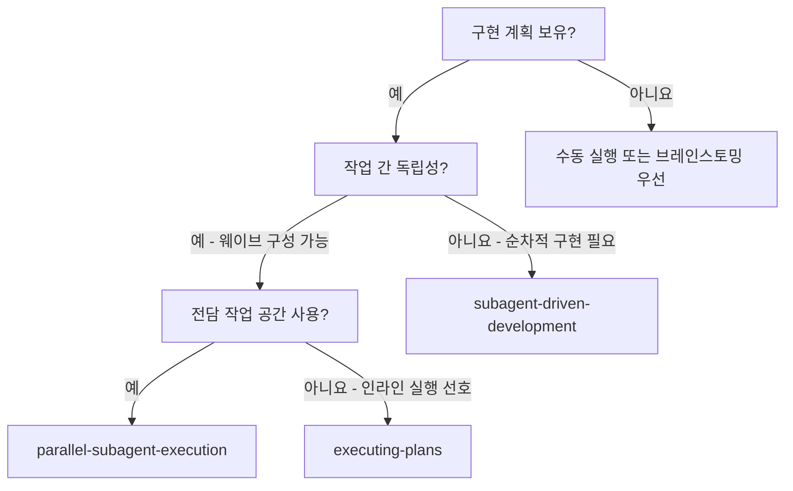

# 병렬 하위 에이전트 실행 (Parallel Subagent Execution)

## 개요

작성된 구현 계획을 독립적이고 충돌이 없는 하위 에이전트들의 웨이브(waves)로 분할하여 실행하고, 모든 웨이브가 통합된 후에 최종 리뷰를 한 번 실행합니다.

**경계:** 이 기술은 '병렬 하위 에이전트(Parallel Subagents)'가 선택되었을 때만 적용됩니다. 선택된 모드가 '인라인 실행(Inline Execution)'인 경우 `superpowers:executing-plans`를 사용하십시오. 선택된 모드가 '하위 에이전트 기반(Subagent-Driven)'인 경우 `superpowers:subagent-driven-development`를 사용하십시오.

**코어 원칙:** 계획 분할 + 명시적 소유권 + 웨이브별 통합 = 한 번의 품질 체크포인트로 대규모 작업의 병렬 처리

## 프로세스

### 1단계: 계획 읽기 및 종속성 분석

작성된 계획을 분석하여 병렬로 실행할 수 있는 작업들을 식별합니다.

### 2단계: 웨이브(Wave) 파티셔닝

작성된 계획의 작업들을 '웨이브'로 그룹화합니다.
- 동일한 웨이브 내의 모든 작업은 동시에 실행될 수 있어야 하며, 동일한 파일을 수정해서는 안 됩니다.
- 각 웨이브는 이전 웨이브가 완료되고 통합된 후에만 발송될 수 있습니다.
- 작업이 모호하거나 리스크가 크며 충돌 가능성이 높은 경우, 나중의 순차적인 웨이브로 이동시키십시오.

### 3단계: 웨이브당 하나의 구현 하위 에이전트 파견

`./implementer-prompt.md`를 사용합니다.

웨이브를 발송하기 전:
- 작업당 하나의 전용 브랜치와 하나의 전용 작업트리(worktree)를 생성합니다.
- 어떤 브랜치와 작업트리가 어떤 작업에 속하는지 기록합니다.
- 각 완료된 작업 브랜치를 어떻게 메인 구현 브랜치로 재통합할지 결정합니다.

각 하위 에이전트는 다음을 전달받아야 합니다:
- 전체 작업 텍스트
- 상황 설정 컨텍스트
- 정확한 파일 소유권
- 필요한 인터페이스 계약
- 할당된 브랜치
- 할당된 작업트리
- 다른 하위 에이전트들이 병렬로 작업 중일 수 있다는 규칙

하위 에이전트가 계획 파일 자체를 읽게 하지 마십시오. 필요한 것만 정확히 제공하십시오.

### 4단계: 대기, 리뷰 및 웨이브 통합

하위 에이전트들이 복귀하면:
- 각 상태와 요약을 확인합니다.
- 하위 에이전트가 할당된 범위를 벗어나서 작성하지 않았는지 확인합니다.
- 계속하기 전에 통합 불일치를 해결합니다.
- 완료된 웨이브에 대한 타겟 검증을 실행합니다.

통합은 명시적이어야 합니다:
- 한 번에 하나의 완료된 작업 브랜치를 메인 구현 브랜치로 재통합합니다.
- 변경 사항을 수동으로 복사하여 붙여넣는 것보다 cherry-pick, merge 또는 그와 동등한 신중한 통합 방식을 선호하십시오.
- 두 작업 사이에 숨겨진 결합이 있는 것으로 밝혀지면, 더 많은 작업을 통합하기 전에 이를 중단하고 해결하십시오.
- 모든 웨이브가 메인 구현 브랜치에 통합된 후 다시 검증을 실행합니다.

하위 에이전트가 `BLOCKED` 또는 `NEEDS_CONTEXT`를 보고하면, 다음 웨이브를 발송하기 전에 이를 중단하고 해결하십시오.

### 5단계: 웨이브별 계속 진행

모든 계획 작업이 완료될 때까지 발송 및 통합 사이클을 반복합니다.

현재 웨이브가 통합되고 검증될 때까지 새로운 웨이브를 시작하지 마십시오.

### 6단계: 최종 검증 및 리뷰

모든 웨이브가 완료된 후:
- 관련 전체 테스트 세트를 실행합니다.
- `superpowers:requesting-code-review`를 호출합니다.
- '중요(Important)' 또는 '심각(Critical)' 문제를 수정합니다.
- 사용자가 통합 작업을 명시적으로 요청하는 경우에만 `superpowers:finishing-a-development-branch`를 사용하십시오.

## 프롬프트 템플릿

- `./implementer-prompt.md` - 명시적 소유권 및 병렬 실행 제약 조건을 포함하여 구현 하위 에이전트를 발송합니다.

## 협업 규칙

**컨트롤러(Controller)의 책임:**
- 작업이 병렬화하기에 안전한지 결정
- 발송 전 파일 소유권 정의
- 하위 에이전트가 직접 만들게 하지 말고 인터페이스 계약 제공
- 전용 실행 브랜치/작업트리 생성 및 안전한 재통합
- 다음으로 넘어가기 전 각 웨이브 통합 및 검증

**하위 에이전트(Subagent)의 책임:**
- 할당된 범위 내에서 작업 유지
- 추측 대신 질문
- 충돌 또는 누락된 컨텍스트 즉시 보고
- 보고 전 자체 리뷰 수행

## 주의 사항(Red Flags)

**절대 금지:**
- 동일한 파일을 수정할 수 있는 두 명의 구현 하위 에이전트를 동시에 발송
- 해결되지 않은 종속성 순서가 있는 작업들을 병렬화
- 하위 에이전트가 소유권을 스스로 찾아내게 함
- 여러 구현자가 동일한 공유 브랜치에 직접 커밋하게 함
- 웨이브 레벨의 통합 실패 무시
- 최종 전체 세트 검증 건너뛰기
- 최종 코드 리뷰 건너뛰기

**웨이브 후 통합이 깨지는 경우:**
- 추가 작업 발송 중단
- 인터페이스 불일치 수정 또는 계획 재수립
- 계속 진행하기 전에 다시 검증 실행

## 통합

**필수 워크플로우 기술:**
- **superpowers:using-git-worktrees** - 필수: 시작 전 격리된 작업 공간 설정
- **superpowers:writing-plans** - 이 기술이 실행할 계획 생성
- **superpowers:requesting-code-review** - 모든 웨이브 완료 후 결합된 결과 리뷰
- **superpowers:finishing-a-development-branch** - 사용자가 통합 작업을 명시적으로 요청하는 경우에만 사용

**하위 에이전트가 사용해야 할 기술:**
- **superpowers:test-driven-development** - 하위 에이전트는 각 작업에 대해 TDD를 따름

**대안 워크플로우:**
- **superpowers:subagent-driven-development** - 작업들이 병렬화하기에 안전하지 않을 때 사용
- **superpowers:executing-plans** - 메인 에이전트가 인라인으로 계획을 실행할 때 사용
