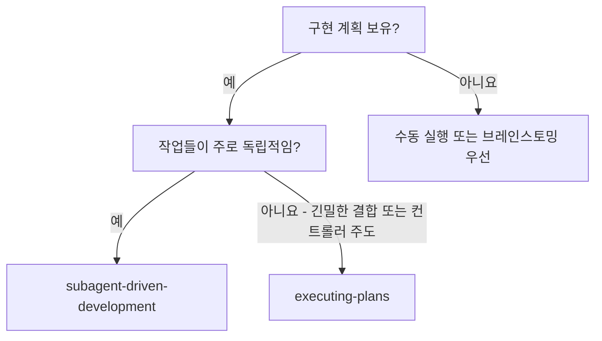

# 하위 에이전트 기반 개발 (Subagent-Driven Development)

작성된 구현 계획을 순차적으로 작업별 신규 하위 에이전트를 파견하여 실행하며, 전체 구현이 완료된 후 최종 리뷰를 한 번 수행합니다.

**경계:** 이 기술은 '하위 에이전트 기반(Subagent-Driven)' 실행이 선택되었을 때만 적용됩니다. 선택된 모드가 '인라인 실행(Inline Execution)'인 경우 `superpowers:executing-plans`를 사용하십시오. 선택된 모드가 '병렬 하위 에이전트(Parallel Subagents)'인 경우 `superpowers:parallel-subagent-execution`을 사용하십시오.

**코어 원칙:** 작업당 신규 하위 에이전트 + 마지막에 최종 리뷰 = 한 번의 품질 체크포인트로 빠른 반복 수행



## 프로세스

```dot
digraph process {
    rankdir=LR;
    node [shape=box];
    "계획 읽기, 모든 작업을 텍스트와 함께 추출, 컨텍스트 기록, TodoWrite 생성" [shape=box];
    "작업이 남아있습니까?" [shape=diamond];
    "전체 구현에 대해 최종 코드 리뷰어 하위 에이전트 발송" [shape=box];

    "계획 읽기, 모든 작업을 텍스트와 함께 추출, 컨텍스트 기록, TodoWrite 생성" -> "구현자 하위 에이전트 발송 (./implementer-prompt.md)";
    "구현자 하위 에이전트 발송 (./implementer-prompt.md)" -> "구현자 하위 에이전트가 질문합니까?";
    "구현자 하위 에이전트가 질문합니까?" -> "답변 제공" [label="예"];
    "구현자 하위 에이전트가 질문합니까?" -> "구현자가 완료 보고" [label="아니요"];
    "답변 제공" -> "구현자가 완료 보고";
    "구현자가 완료 보고" -> "TodoWrite에서 작업을 완료로 표시";
    "TodoWrite에서 작업을 완료로 표시" -> "작업이 남아있습니까?";
    "작업이 남아있습니까?" -> "구현자 하위 에이전트 발송 (./implementer-prompt.md)" [label="예"];
    "작업이 남아있습니까?" -> "전체 구현에 대해 최종 코드 리뷰어 하위 에이전트 발송" [label="아니요"];
    "전체 구현에 대해 최종 코드 리뷰어 하위 에이전트 발송" -> "명시적인 통합 요청이 있습니까?";
    "명시적인 통합 요청이 있습니까?" [shape=diamond];
    "superpowers:finishing-a-development-branch 사용" [shape=box style=filled fillcolor=lightgreen];
    "완료" [shape=ellipse];
    "명시적인 통합 요청이 있습니까?" -> "superpowers:finishing-a-development-branch 사용" [label="예"];
    "명시적인 통합 요청이 있습니까?" -> "완료" [label="아니요"];
}
```



### 1단계: 계획 읽기 및 작업 추출
계획 파일을 열고 모든 구현 작업을 정확한 텍스트 및 검증 지침과 함께 식별합니다.

### 2단계: Todo 스트림 생성
모든 작업을 `TodoWrite` 도구를 사용하여 기록합니다. 진행 상황을 추적하기 위해 `task_id`를 사용하십시오.

### 3단계: 작업별 반복
각 작업에 대해:
1. `in_progress` 단계로 표시합니다.
2. `./implementer-prompt.md` 템플릿을 사용하여 구현자(Implementer) 하위 에이전트를 파견합니다.
3. 하위 에이전트에게 필요한 전체 코드 베이스 컨텍스트를 제공하되, 대화 히스토리는 제외하십시오.
4. 하위 에이전트가 질문하면 필요한 명확한 답변을 제공하십시오.
5. 하위 에이전트가 테스트 및 구현을 완료하면, 그 결과를 검토하고 작업을 `completed`로 표시합니다.

### 4단계: 최종 검증 및 리뷰
모든 작업이 완료된 후:
1. 메인 에이전트 세션에서 관련 테스트 스위트를 실행하여 전체 구현을 검증합니다.
2. `superpowers:requesting-code-review`를 호출하여 최종 코드 리뷰를 수행합니다.
3. 리뷰어가 '중요(Important)' 또는 '심각(Critical)' 문제를 지적하면, 이를 수정하십시오.
4. 사용자가 통합 작업을 명시적으로 요청하는 경우에만 `superpowers:finishing-a-development-branch`를 사용하십시오.

## 프롬프트 템플릿
- `./implementer-prompt.md` - 작업을 수행할 하위 에이전트를 파견합니다.

## 고려 사항

**하위 에이전트(Subagent) 위임:**
- 각 하위 에이전트는 신규 상태로 시작해야 합니다 (신규 에이전트 또는 `Task` 도구 사용).
- 대화 히스토리를 전달하지 마십시오.
- 파일 내용, 기술 스택, 규칙 및 해당 작업 내용만 제공하십시오.
- 하위 에이전트는 작업 전후에 질문할 수 있도록 허용되어야 합니다.

**플랜 실행(Executing Plans)과의 차별점:**
- 작업 간 완전한 격리
- 더 강한 컨트롤러(Controller) 조정 오버헤드
- 구현 작업 간의 명확한 분리

**효율성 이득:**
- 파일 읽기 오버헤드 없음 (컨트롤러가 필요한 텍스트 전체 제공)
- 구현 중 컨텍스트 오염 없음
- 컨트롤러는 조율과 통합에 집중할 수 있음

## 예시 세션

```
[작성된 계획 로드]
사용자: TodoWrite를 생성하고 구현을 시작하겠습니다.

[작업 1 발송: 신규 하위 에이전트에게 implementer-prompt 전달]
하위 에이전트: [작업 1 구현 완료 보고]

[작업 2 발송: 신규 하위 에이전트에게 implementer-prompt 전달]
하위 에이전트: [작업 2 구현 완료 보고]

[모든 작업 완료 후]
[git SHA 가져오기, 최종 코드 리뷰어 발송]
최종 리뷰어: 장점: 좋은 커버리지, 깔끔한 구현. 문제 없음. 요청된 다음 통합 단계를 진행할 준비가 되었습니다.

완료!
```

## 주의 사항(Red Flags)

**절대 금지:**
- 이전 에이전트의 컨텍스트를 다음 에이전트로 전달 (격리 유지)
- 사전에 파일을 읽지 않고 에이전트 파견
- 하위 에이전트가 질문할 때 추측하도록 방치
- 최종 코드 리뷰 건너뛰기
- 전체 테스트 세트 검증 건너뛰기
- 하위 에이전트에게 구현을 중단하도록 압박

**최종 리뷰어가 문제를 발견한 경우:**
- 요청된 통합 단계 전에 문제를 수정하십시오.
- 문제가 중대한 경우 최종 리뷰를 다시 실행하십시오.
- 머지를 방해하는(merge-blocking) 피드백을 무시하지 마십시오.

## 통합

**필수 워크플로우 기술:**
- **superpowers:using-git-worktrees** - 필수: 시작 전 격리된 작업 공간 설정
- **superpowers:writing-plans** - 이 기술이 실행할 계획을 생성
- **superpowers:requesting-code-review** - 리뷰어 하위 에이전트를 위한 코드 리뷰 템플릿
- **superpowers:finishing-a-development-branch** - 사용자가 통합 작업을 명시적으로 요청하는 경우에만 사용

**하위 에이전트가 사용해야 할 기술:**
- **superpowers:test-driven-development** - 하위 에이전트는 각 작업에 대해 TDD를 따름

**대안 워크플로우:**
- **superpowers:parallel-subagent-execution** - 계획을 독립적이고 충돌 없는 병렬 웨이브로 나눌 수 있는 경우 사용
- **superpowers:executing-plans** - 선택된 모드가 메인 에이전트의 직접 인라인 실행인 경우 사용
