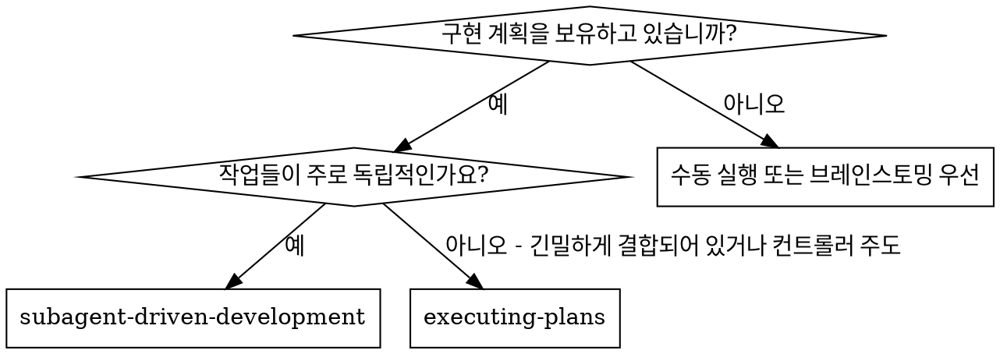
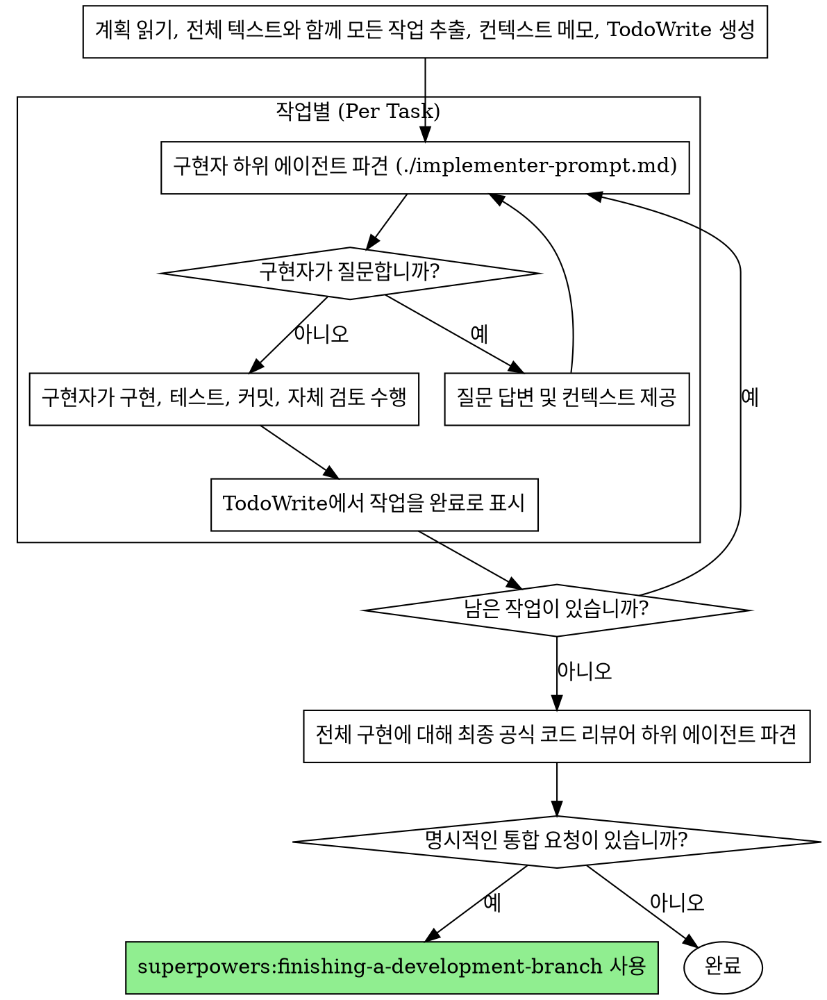

# 하위 에이전트 기반 개발 (Subagent-Driven Development)

작성된 구현 계획을 실행할 때, 순차적으로 각 작업당 신규 하위 에이전트를 하나씩 파견(dispatch)하여 작업을 수행하고, 전체 구현 완료 후 최종 공식 리뷰(final formal review)를 한 번 수행합니다.

**경계:** 이 기술은 '하위 에이전트 기반(Subagent-Driven)' 실행 모드가 선택되었을 때만 적용됩니다. 선택된 모드가 '인라인 실행(Inline Execution)'인 경우 `superpowers:executing-plans`를 사용하십시오. 선택된 모드가 '병렬 하위 에이전트(Parallel Subagents)'인 경우 `superpowers:parallel-subagent-execution`을 사용하십시오.

**레인(Lane):** 이 워크플로우는 Full Lane 전용입니다. 작업이 작고 국소적이라면 메인 에이전트 인라인 실행을 대신 사용하십시오.

**핵심 원칙:** 작업당 신규 하위 에이전트 + 마지막에 최종 공식 리뷰 한 번 = 한 번의 품질 체크포인트로 빠른 반복 수행

## 리뷰 경계 (Review Boundaries)

- 구현자 자체 검토(Implementer self-review)는 각 작업 내부에서 일어납니다. 이는 로컬 품질 검사이며 워크플로우의 공식 리뷰가 아닙니다.
- 이 워크플로우에서는 일상적인 작업 단위 공식 리뷰를 파견하지 마십시오.
- 공식 리뷰(Formal review)는 완료된 전체 통합 결과물에 대해 `superpowers:requesting-code-review`를 호출하는 것을 의미하며, 모든 작업이 완료된 후 한 번 실행됩니다.
- `superpowers:receiving-code-review`는 최종 공식 리뷰에서 검토가 필요한 피드백을 반환할 때에만 사용하십시오.

## 사용 시기



## 프로세스



## 모델 선택 (Model Selection)

비용을 절약하고 속도를 높이기 위해 각 역할에 맞는 가장 가벼운(최소한의 강력함을 가진) 모델을 사용하십시오.

**기계적인 구현 작업** (독립된 함수, 명확한 스펙, 파일 1~2개 수정): 빠르고 저렴한 모델을 사용하십시오. 계획이 잘 명세되어 있다면 대부분의 구현 작업은 기계적입니다.

**통합 및 판단 작업** (여러 파일 간 조율, 패턴 매칭, 디버깅): 표준 모델을 사용하십시오.

**아키텍처, 디자인, 리뷰 작업**: 가장 가용한 뛰어난 모델을 사용하십시오.

**작업 복잡성 판단 기준:**
- 완전한 스펙이 있으며 1~2개의 파일을 다루는 경우 → 저렴한 모델
- 통합이 필요한 여러 파일을 다루는 경우 → 표준 모델
- 아키텍처 판단이나 코드베이스 전반에 대한 이해가 필요한 경우 → 가장 강력한 모델

## 구현자 상태 처리 (Handling Implementer Status)

구현자(Implementer) 하위 에이전트는 다음 네 가지 상태 중 하나를 보고합니다. 각 상태를 적절히 처리하십시오:

**완료 (DONE):** 다음 작업으로 넘어가거나, 모든 작업이 완료된 경우 최종 공식 리뷰로 넘어갑니다.

**우려사항이 있는 완료 (DONE_WITH_CONCERNS):** 구현자가 작업을 완료했지만 의문점을 표시했습니다. 계속 진행하기 전에 우려사항을 읽어 확인하십시오. 정확성이나 범위에 대한 우려라면 넘어가기 전에 해결하십시오. 단순한 관찰(예: "이 파일이 너무 길어지고 있습니다")이라면 기록만 하고 계속 진행하십시오.

**컨텍스트 필요 (NEEDS_CONTEXT):** 구현자에게 미처 제공되지 않은 정보가 필요합니다. 누락된 컨텍스트를 제공하고 다시 파견하십시오.

**차단됨 (BLOCKED):** 구현자가 작업을 완료할 수 없습니다. 원인을 평가하십시오:
1. 컨텍스트 문제인 경우, 더 많은 정보를 제공하고 동일한 모델로 재파견하십시오.
2. 더 고도의 추론이 필요한 작업인 경우, 더 강력한 모델로 재파견하십시오.
3. 작업이 너무 큰 경우, 더 작은 단위로 쪼개십시오.
4. 계획 자체가 잘못된 경우, 사용자인 사람(Human)에게 문제를 넘기십시오(escalate).

**절대** 문제 제기(escalation)를 무시하거나, 아무런 변경 없이 같은 모델에게 재시도를 강제하지 마십시오. 구현자가 막혔다고 보고했다면, 무언가를 변경해야 합니다.

## 프롬프트 템플릿

- `./implementer-prompt.md` - 구현자 하위 에이전트 파견

## 예시 워크플로우

```
여러분: 이 계획을 실행하기 위해 하위 에이전트 기반 개발(Subagent-Driven Development)을 사용하겠습니다.

[계획 파일 읽기: docs/superpowers/plans/feature-plan.md]
[전체 텍스트 및 컨텍스트와 함께 모든 5개의 작업 추출]
[모든 작업을 포함하는 TodoWrite 생성]

작업 1: Hook 설치 스크립트 작성

[작업 1의 전체 텍스트 및 컨텍스트 가져오기 (이미 추출됨)]
[작업 텍스트 + 컨텍스트와 함께 구현자 하위 에이전트 파견]

구현자: "작업을 시작하기 전에 - hook을 사용자 계층에 설치해야 합니까, 아니면 시스템 계층에 설치해야 합니까?"

여러분: "사용자 계층에 설치하십시오 (~/.config/superpowers/hooks/)"

구현자: "알겠습니다. 구현을 시작하겠습니다..."
[시간 경과 후] 구현자:
  - install-hook 명령어 구현 완료
  - 테스트 추가, 5/5 통과
  - 자체 검토: --force 플래그를 누락한 것을 발견하여 추가함
  - 커밋 완료

[작업 1 완료로 표시]

작업 2: 복구 모드 (Recovery modes)

[작업 2의 텍스트 및 컨텍스트 가져오기]
[작업 텍스트 + 컨텍스트와 함께 구현자 하위 에이전트 파견]

구현자: [질문 없이 진행]
구현자:
  - 검증/복구(verify/repair) 모드 추가 완료
  - 8/8 테스트 통과
  - 자체 검토: 문제 없음
  - 커밋 완료

[작업 2 완료로 표시]

...

[모든 작업 완료 후]
[git SHA 가져오기 및 최종 공식 코드 리뷰어 파견]
최종 리뷰어: 장점: 뛰어난 테스트 커버리지, 깔끔한 코드 구현. 수정 사항: 없음. 다음 통합 단계를 진행할 준비가 되었습니다.

완료!
```

## 장점 (Advantages)

**수동 실행 (Manual execution) 대비 장점:**
- 하위 에이전트들이 자연스럽게 TDD를 따릅니다.
- 작업마다 새로운 컨텍스트가 주어져 혼동이 없습니다.
- 하위 에이전트들이 서로 간섭하지 않아 병렬화에 안전합니다.
- 하위 에이전트가 작업 도중은 물론 작업 시작 전에도 스스로 질문을 던집니다.

**플랜 직접 실행 (Executing Plans) 대비 장점:**
- 작업들 사이의 격리가 철저합니다.
- 조율자(Controller)로서 관리가 더 필요합니다.
- 각 구현 작업 간의 명확한 경계가 있습니다.

**효율성 이득:**
- 매번 파일을 읽을 필요가 없습니다 (조율자가 전체 텍스트를 제공합니다).
- 조율자가 어떤 컨텍스트가 필요한지 정확히 선별합니다.
- 하위 에이전트가 시작부터 완전한 정보를 받습니다.
- 작업 이후가 아닌 작업 전에 미리 의문점이 제기됩니다.

**품질 보증 장치 (Quality gates):**
- 자체 검토 단계에서 핸드오프 전에 이슈를 해결합니다.
- 최종 공식 리뷰에서 머지(merge)전에 다수 작업 간에 걸친 이슈들을 찾아냅니다.
- 작업을 시작하기 전에 하위 에이전트가 던지는 질문을 통해 모호함을 제거합니다.

**비용 (Cost):**
- 메인 에이전트 직접(inline) 실행보다 하위 에이전트를 더 여러 번 호출하게 됩니다.
- 조율자가 초기에 모든 작업을 분리 추출하느라 사전 준비 작업이 많습니다.
- 구현 중에 끊기는 횟수는 더 적습니다.
- 최종 공식 리뷰에서 나중에 이슈를 찾아낼 수는 있지만 반복 속도는 향상됩니다.

## 주의 신호 (Red Flags)

**절대 금지:**
- 사용자의 명시적인 동의 없이 main/master 브랜치에서 구현 시작하기
- 검증 단계를 완전히 건너뛰기
- 고쳐지지 않은 에러를 둔 채로 계속 진행하기
- 현재 워크플로우 안에서 여러 하위 에이전트를 병렬적으로 동시에 파견하기 (계획이 병렬 웨이브 단위에 안전하게 나뉘어지는 경우라면 대신 `parallel-subagent-execution`을 사용하십시오)
- 하위 에이전트가 직접 계획 파일을 읽게 만들기 (전체 텍스트로 대신 내용을 제공하십시오)
- 상황 파악에 필요한 컨텍스트 생략 (자신이 맡은 일이 큰 그림 안에서 어디에 위치하는지 이해해야 합니다)
- 하위 에이전트 질문 무시 (작업을 진행하도록 내버려두기 전에 질문에 답하십시오)
- 구현자의 자체 검토를 워크플로우의 공식 리뷰로 취급하기
- 구현자가 스스로 문제의 정확성에 대한 우려를 제기했는데 해결하지 않은 채 다음 작업으로 이동하기

**하위 에이전트가 질문할 경우:**
- 명확하고 완전하게 답하십시오.
- 필요하다면 추가 컨텍스트를 제공하십시오.
- 서둘러 구현을 진행하도록 재촉하지 마십시오.

**최종 리뷰어가 이슈를 발견한 경우:**
- 어떠한 통합 단계가 요청되더라도 이슈를 먼저 해소한 뒤 진행하십시오.
- 이슈가 중대하다면 최종 리뷰를 다시 진행하십시오.
- 머지를 가로막을 만한 치명적인 피드백을 방치하지 마십시오.

**하위 에이전트가 작업에 실패할 경우:**
- 명확한 추가 지시사항을 주고 해결용(fix) 하위 에이전트를 파견하십시오.
- 메인 에이전트가 스스로 직접 수정하려 시도하지 마십시오 (컨텍스트 오염을 유발합니다).

## 통합 (Integration)

**필수 워크플로우 기술:**
- **superpowers:using-git-worktrees** - 필수: 시작 전에 격리된 작업 공간을 생성합니다.
- **superpowers:writing-plans** - 해당 기술이 곧 실행할 계획서를 생성합니다.
- **superpowers:requesting-code-review** - 필수: 완료된 전체 통합 결과물에 대한 최종 공식 리뷰.
- **superpowers:receiving-code-review** - 최종 공식 리뷰에서 검토가 필요한 피드백을 반환할 때 사용합니다.
- **superpowers:finishing-a-development-branch** - 사용자가 통합 작업을 명시적으로 요구한 경우에만 사용합니다.

**하위 에이전트가 사용해야 하는 기술:**
- **superpowers:test-driven-development** - 하위 에이전트가 매 작업마다 TDD를 따라야 합니다.

**대안 워크플로우:**
- **superpowers:parallel-subagent-execution** - 실행 계획을 상호 충돌 없이 독립적인 병렬 웨이브로 파티셔닝할 수 있을 때 사용합니다.
- **superpowers:executing-plans** - 메인 에이전트가 직접 인라인(inline)으로 실행할 때 사용합니다.
