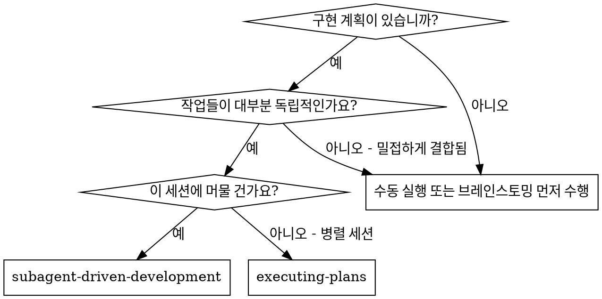
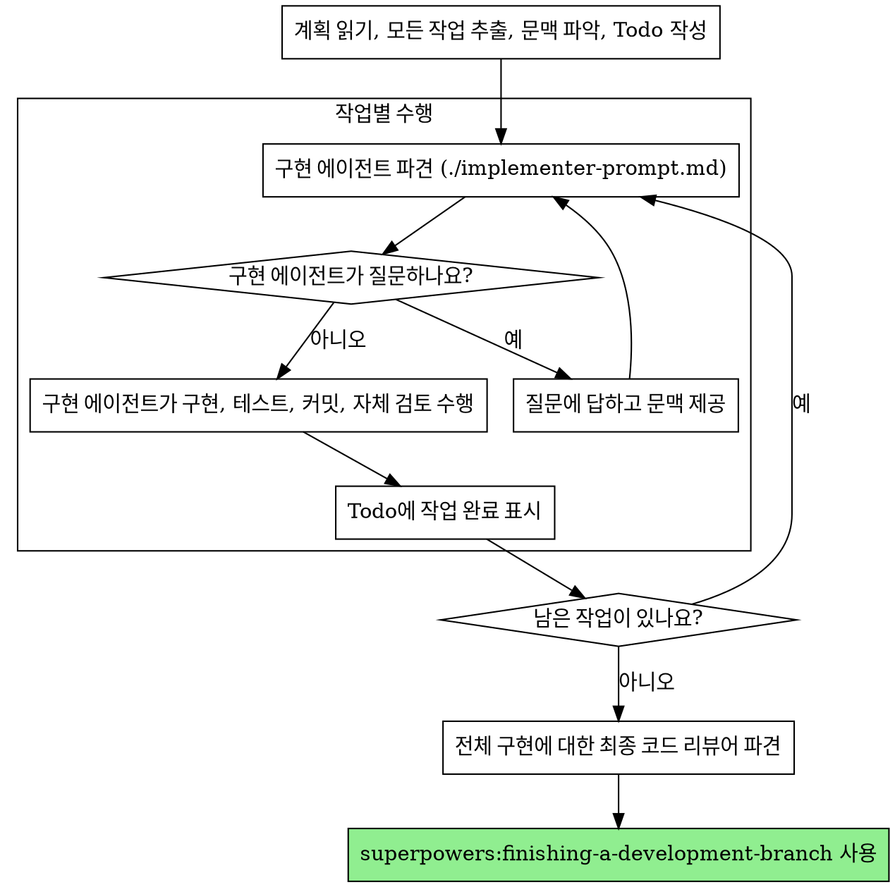

# 서브에이전트 주도 개발 (Subagent-Driven Development)

작업당 신선한 서브에이전트를 파견하여 계획을 실행하고, 전체 구현이 완료된 후에 최종 리뷰를 한 번 수행합니다.

**서브에이전트를 사용하는 이유:** 문맥이 분리된 전문화된 에이전트에게 작업을 위임하기 위함입니다. 지침과 문맥을 정밀하게 구성함으로써 에이전트가 작업에 집중하고 성공하도록 보장할 수 있습니다. 에이전트는 여러분의 세션 문맥이나 히스토리를 절대로 상속받아서는 안 됩니다. 여러분은 에이전트에게 필요한 것만 정확하게 구성해서 제공해야 합니다. 이는 여러분 자신의 코디네이션 작업을 위한 문맥을 보존하는 데에도 도움이 됩니다.

**핵심 원칙:** 작업당 신선한 서브에이전트 + 마지막에 최종 리뷰 = 한 번의 품질 체크포인트와 빠른 반복

## 사용 시기



**계획 실행 (병렬 세션)와의 비교:**
- 동일 세션 유지 (문맥 전환 없음)
- 작업당 신선한 서브에이전트 (문맥 오염 없음)
- 작업 실행 중 체크포인트 대신 구현 완료 후 최종 리뷰 수행
- 빠른 반복 (작업 사이에 사람이 개입할 필요 없음)

## 프로세스



## 모델 선택

비용을 절약하고 속도를 높이기 위해 각 역할에 적합한 가장 덜 강력한 모델을 사용하십시오.

**기계적인 구현 작업** (독립된 함수, 명확한 사양, 1~2개 파일): 빠르고 저렴한 모델을 사용하십시오. 계획이 잘 상세화되어 있다면 대부분의 구현 작업은 기계적입니다.

**통합 및 판단 작업** (다중 파일 조정, 패턴 매칭, 디버깅): 표준 모델을 사용하십시오.

**아키텍처, 설계 및 리뷰 작업**: 사용 가능한 가장 성능이 좋은 모델을 사용하십시오.

**작업 복잡도 신호:**
- 전체 사양이 포함된 1~2개 파일 수정 → 저렴한 모델
- 통합 고려 사항이 있는 여러 파일 수정 → 표준 모델
- 설계 판단 또는 광범위한 코드베이스 이해 필요 → 가장 성능 좋은 모델

## 구현 에이전트 상태 처리

구현 서브에이전트는 네 가지 상태 중 하나를 보고합니다. 각 상태를 적절히 처리하십시오:

**DONE:** 다음 작업으로 이동하거나, 모든 작업이 완료되었다면 최종 리뷰로 진행하십시오.

**DONE_WITH_CONCERNS:** 작업을 완료했지만 의구심이 남는 경우입니다. 진행하기 전에 우려 사항을 읽어보십시오. 우려 사항이 정확성이나 범위에 관한 것이라면 다음 단계로 넘어가기 전에 이를 해결하십시오. 단순한 관찰 내용(예: "이 파일이 너무 커지고 있습니다")이라면 메모하고 진행하십시오.

**NEEDS_CONTEXT:** 제공되지 않은 정보가 필요한 경우입니다. 누락된 문맥을 제공하고 다시 파견하십시오.

**BLOCKED:** 작업을 완료할 수 없는 상태입니다. 차단 요인을 평가하십시오:
1. 문맥 문제라면 더 많은 문맥을 제공하고 동일한 모델로 다시 파견합니다.
2. 더 많은 추론이 필요한 작업이라면 더 성능 좋은 모델로 다시 파견합니다.
3. 작업이 너무 크다면 더 작은 단위로 나눕니다.
4. 계획 자체가 잘못되었다면 사용자에게 보고합니다.

에스컬레이션을 무시하거나 변경 없이 동일한 모델에게 재시도를 강요해서는 **절대 안 됩니다.** 에이전트가 막혔다고 하면 무언가 변경이 필요하다는 뜻입니다.

## 프롬프트 템플릿

- `./implementer-prompt.md` - 구현 서브에이전트 파견

## 워크플로우 예시

```
여러분: 이 계획을 실행하기 위해 서브에이전트 주도 개발을 사용하겠습니다.

[계획 파일 읽기: docs/superpowers/plans/feature-plan.md]
[본문 및 문맥을 포함한 5개 작업 모두 추출]
[모든 작업이 포함된 Todo 작성]

작업 1: 훅 설치 스크립트

[추출된 작업 1의 텍스트와 문맥 가져오기]
[전체 작업 텍스트 및 문맥과 함께 구현 서브에이전트 파견]

구현 에이전트: "시작하기 전에 - 훅을 사용자 수준에 설치해야 하나요, 시스템 수준에 설치해야 하나요?"

여러분: "사용자 수준입니다 (~/.config/superpowers/hooks/)"

구현 에이전트: "알겠습니다. 지금 구현하겠습니다..."
[잠시 후] 구현 에이전트:
  - install-hook 명령 구현 완료
  - 테스트 추가, 5/5 통과
  - 자체 검토: --force 플래그 누락 발견하여 추가함
  - 커밋 완료

[작업 1 완료 표시]

작업 2: 복구 모드

[추출된 작업 2의 텍스트와 문맥 가져오기]
[전체 작업 텍스트 및 문맥과 함께 구현 서브에이전트 파견]

구현 에이전트: [질문 없이 진행]
구현 에이전트:
  - verify/repair 모드 추가 완료
  - 8/8 테스트 통과
  - 자체 검토: 이상 없음
  - 커밋 완료

[작업 2 완료 표시]

...

[모든 작업 완료 후]
[git SHA를 가져와서 최종 코드 리뷰어 파견]
최종 리뷰어: 장점: 좋은 테스트 커버리지, 깔끔한 구현. 이슈: 없음. 머지 준비 완료.

완료!
```

## 장점

**수동 실행 대비:**
- 서브에이전트가 자연스럽게 TDD를 따름
- 작업당 신선한 문맥 제공 (혼동 방지)
- 병렬 안전성 (서브에이전트들이 서로 간섭하지 않음)
- 서브에이전트가 작업 전후에 질문할 수 있음

**계획 실행(Executing Plans) 대비:**
- 동일 세션 유지 (핸드오버 없음)
- 지속적인 진행 (대기 시간 없음)
- 최종 리뷰 자동화

**효율성 증대:**
- 파일 읽기 오버헤드 없음 (컨트롤러가 전체 텍스트 제공)
- 컨트롤러가 필요한 문맥만 정확히 선별
- 서브에이전트가 시작부터 완전한 정보를 받음
- 작업 시작 전 질문 표면화 (사후가 아님)

**품질 게이트:**
- 자체 검토를 통해 인도 전 문제 포착
- 최종 리뷰를 통해 머지 전 교차 작업 이슈 포착
- 작업 시작 전 질문을 통해 모호성 제거

**비용:**
- 인라인 실행보다 에이전트 호출 횟수가 많음
- 컨트롤러의 선행 작업 증가 (모든 작업 사전 추출)
- 구현 도중 리뷰로 인한 중단이 적음
- 최종 리뷰에서 나중에 이슈가 발견될 수 있으나, 반복 속도가 더 빠름

## 주의 신호 (Red Flags)

**절대 금지:**
- 사용자의 명시적인 동의 없이 main/master 브랜치에서 구현 시작
- 검증(테스트) 절차 생략
- 수정되지 않은 이슈가 있는 상태로 진행
- 여러 구현 서브에이전트를 병렬로 파견 (충돌 발생)
- 서브에이전트에게 계획 파일을 직접 읽게 함 (전체 텍스트를 제공하십시오)
- 상황 설정 문맥 생략 (에이전트는 작업의 위치를 이해해야 함)
- 서브에이전트의 질문 무시 (진행 전 답변 필수)
- 구현이 위험한 경우, 자체 검토가 최종 리뷰를 대체하게 함
- 구현자가 정확성에 대해 해결되지 않은 의구심을 표명했음에도 다음 작업으로 이동

**서브에이전트가 질문하는 경우:**
- 명확하고 완벽하게 답변하십시오.
- 필요한 경우 추가 문맥을 제공하십시오.
- 대답 없이 구현을 재촉하지 마십시오.

**최종 리뷰어가 이슈를 발견하는 경우:**
- 브랜치를 마무리하기 전에 이슈를 수정하십시오.
- 이슈가 중대한 경우 최종 리뷰를 다시 실행하십시오.
- 머지를 가로막는 피드백을 무시하지 마십시오.

**서브에이전트가 작업을 실패한 경우:**
- 구체적인 지침과 함께 수정 에이전트를 파견하십시오.
- 수동으로 수정하려 하지 마십시오 (문맥 오염 우려).

## 통합

**필수 워크플로우 기술:**
- **superpowers:using-git-worktrees** - 필수: 시작 전 격리된 작업 공간 설정
- **superpowers:writing-plans** - 이 기술이 실행할 계획을 생성
- **superpowers:requesting-code-review** - 리뷰어 서브에이전트를 위한 코드 리뷰 템플릿
- **superpowers:finishing-a-development-branch** - 모든 작업 후 개발 완료

**서브에이전트가 사용해야 할 기술:**
- **superpowers:test-driven-development** - 서브에이전트는 각 작업에 대해 TDD를 따름

**대안 워크플로우:**
- **superpowers:executing-plans** - 동일 세션 실행 대신 병렬 세션을 사용할 때 사용
