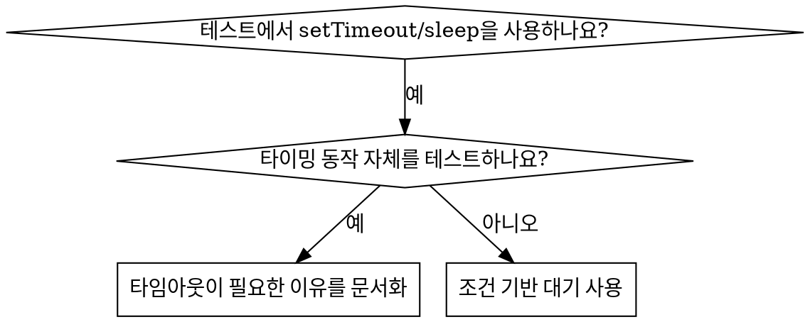

# 조건 기반 대기 (Condition-Based Waiting)

## 개요

불안정한 테스트(Flaky tests)는 대개 임의의 지연 시간(delay)을 설정하여 타이밍을 추측합니다. 이는 빠른 기기에서는 통과하지만 부하가 걸리거나 CI 환경에서는 실패하는 경합 조건(Race condition)을 유발합니다.

**핵심 원칙:** 작업이 얼마나 걸릴지 추측하지 말고, 여러분이 중요하게 생각하는 **실제 조건**이 충족될 때까지 기다리십시오.

## 사용 시기



**사용하는 경우:**
- 테스트에 임의의 지연 시간(`setTimeout`, `sleep`, `time.sleep()`)이 포함된 경우
- 테스트가 불안정한 경우 (어떨 때는 통과하고, 부하가 걸리면 실패함)
- 테스트를 병렬로 실행할 때 타임아웃이 발생하는 경우
- 비동기 작업이 완료되기를 기다리는 경우

**사용하지 않는 경우:**
- 실제 타이밍 동작(디바운스, 스로틀 간격 등)을 테스트하는 경우
- 임의의 타임아웃을 사용하는 경우 반드시 그 **이유**를 문서화하십시오.

## 핵심 패턴

```typescript
// ❌ 기존 방식: 타이밍 추측
await new Promise(r => setTimeout(r, 50));
const result = getResult();
expect(result).toBeDefined();

// ✅ 개선된 방식: 조건 충족 시까지 대기
await waitFor(() => getResult() !== undefined);
const result = getResult();
expect(result).toBeDefined();
```

## 빠른 패턴 참조

| 시나리오 | 패턴 |
|----------|---------|
| 이벤트 대기 | `waitFor(() => events.find(e => e.type === 'DONE'))` |
| 상태 대기 | `waitFor(() => machine.state === 'ready')` |
| 개수 대기 | `waitFor(() => items.length >= 5)` |
| 파일 존재 대기 | `waitFor(() => fs.existsSync(path))` |
| 복합 조건 대기 | `waitFor(() => obj.ready && obj.value > 10)` |

## 구현 예시

범용 폴링(Polling) 함수:
```typescript
async function waitFor<T>(
  condition: () => T | undefined | null | false,
  description: string,
  timeoutMs = 5000
): Promise<T> {
  const startTime = Date.now();

  while (true) {
    const result = condition();
    if (result) return result;

    if (Date.now() - startTime > timeoutMs) {
      throw new Error(`${timeoutMs}ms 동안 ${description} 대기 중 타임아웃 발생`);
    }

    await new Promise(r => setTimeout(r, 10)); // 10ms마다 확인
  }
}
```

실제 디버깅 세션에서 사용된 도메인별 헬퍼(`waitForEvent`, `waitForEventCount`, `waitForEventMatch`)가 포함된 완전한 구현은 이 디렉토리의 `condition-based-waiting-example.ts`를 참조하십시오.

## 흔한 실수

**❌ 너무 빠른 폴링:** `setTimeout(check, 1)` - CPU 자원 낭비
**✅ 해결책:** 10ms 간격으로 확인하십시오.

**❌ 타임아웃 없음:** 조건이 영원히 충족되지 않을 경우 무한 루프에 빠짐
**✅ 해결책:** 항상 명확한 에러 메시지와 함께 타임아웃을 설정하십시오.

**❌ 오래된 데이터(Stale data):** 루프 밖에서 상태를 캐싱함
**✅ 해결책:** 최신 데이터를 얻기 위해 루프 안에서 getter를 호출하십시오.

## 임의의 타임아웃이 정답인 경우

```typescript
// 도구가 100ms마다 실행됨 - 부분 출력을 확인하기 위해 2번의 틱(tick)이 필요함
await waitForEvent(manager, 'TOOL_STARTED'); // 먼저: 조건이 충족될 때까지 대기
await new Promise(r => setTimeout(r, 200));   // 그 다음: 타이밍 동작 대기
// 200ms = 100ms 간격의 2번의 틱 - 문서화되고 정당화된 수치임
```

**요구 사항:**
1. 먼저 유발 조건을 기다립니다.
2. 알려진 타이밍을 기반으로 합니다 (추측이 아님).
3. **이유**를 설명하는 주석을 남깁니다.

## 실제 사례 영향

디버깅 세션 (2025-10-03) 결과:
- 3개 파일에 걸친 15개의 불안정한 테스트 수정
- 통과율: 60% → 100%
- 실행 속도: 40% 향상
- 경합 조건(Race condition) 해결
