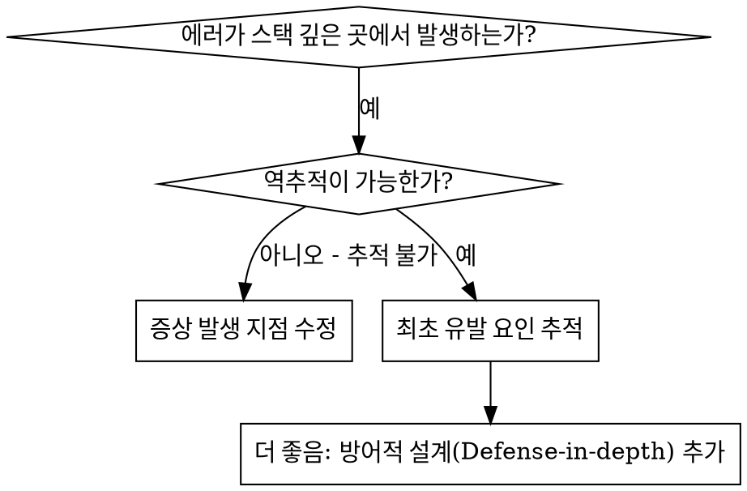
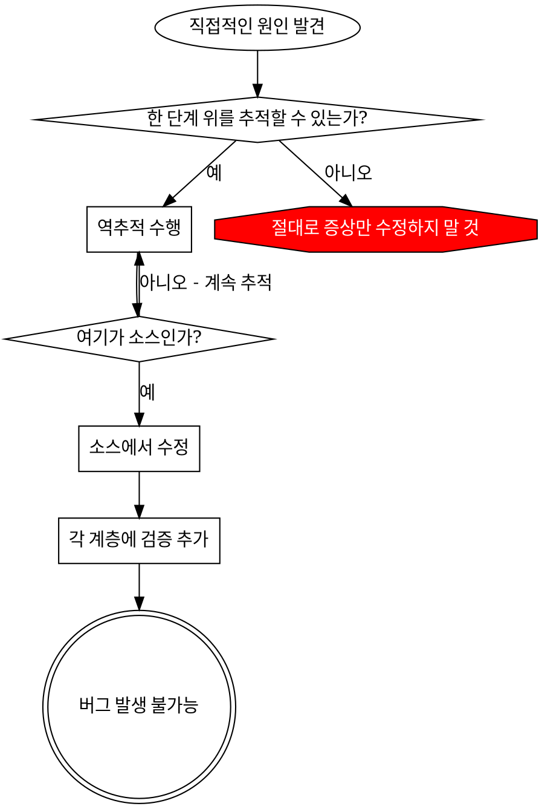

# 근본 원인 추적 (Root Cause Tracing)

## 개요

버그는 콜 스택 깊은 곳에서 나타나는 경우가 많습니다 (엉뚱한 디렉토리에서 git init 실행, 잘못된 위치에 파일 생성, 잘못된 경로로 데이터베이스 열기 등). 본능적으로 에러가 발생한 지점을 수정하고 싶겠지만, 그것은 증상만 고치는 것에 불과합니다.

**핵심 원칙:** 최초의 유발 요인을 찾을 때까지 호출 체인을 역으로 추적하고, 원본 소스에서 수정하십시오.

## 사용 시기



**사용하는 경우:**
- 에러가 실행 깊숙한 곳에서 발생할 때 (진입점이 아님)
- 스택 트레이스에 긴 호출 체인이 보일 때
- 잘못된 값이 어디에서 시작되었는지 불분명할 때
- 어떤 테스트나 코드가 문제를 유발하는지 찾아야 할 때

## 추적 프로세스

### 1단계: 증상 관찰
```
Error: git init failed in /Users/jesse/project/packages/core
```

### 2단계: 직접적인 원인 찾기
**어떤 코드가 이를 직접적으로 유발했는가?**
```typescript
await execFileAsync('git', ['init'], { cwd: projectDir });
```

### 3단계: 질문하기: 무엇이 이를 호출했는가?
```typescript
WorktreeManager.createSessionWorktree(projectDir, sessionId)
  → Session.initializeWorkspace() 에서 호출됨
  → Session.create() 에서 호출됨
  → Project.create() 테스트 코드에서 호출됨
```

### 4단계: 계속해서 거슬러 올라가기
**어떤 값이 전달되었는가?**
- `projectDir = ''` (빈 문자열!)
- `cwd`로 빈 문자열이 전달되면 `process.cwd()`로 해석됨
- 그곳은 바로 소스 코드 디렉토리임!

### 5단계: 최초 유발 요인 찾기
**빈 문자열은 어디에서 왔는가?**
```typescript
const context = setupCoreTest(); // { tempDir: '' }를 반환함
Project.create('name', context.tempDir); // beforeEach 실행 전에 접근함!
```

## 스택 트레이스 추가하기

수동으로 추적하기 어려울 때는 진단 코드를 추가하십시오:

```typescript
// 문제가 되는 작업 직전에 추가
async function gitInit(directory: string) {
  const stack = new Error().stack;
  console.error('디버그 git init:', {
    directory,
    cwd: process.cwd(),
    nodeEnv: process.env.NODE_ENV,
    stack,
  });

  await execFileAsync('git', ['init'], { cwd: directory });
}
```

**중요:** 테스트에서는 `console.error()`를 사용하십시오 (로거는 출력되지 않을 수 있음).

**실행 및 캡처:**
```bash
npm test 2>&1 | grep '디버그 git init'
```

**스택 트레이스 분석:**
- 테스트 파일 이름을 찾으십시오.
- 호출을 유발한 라인 번호를 찾으십시오.
- 패턴을 파악하십시오 (동일한 테스트인가? 동일한 파라미터인가?).

## 어떤 테스트가 오염을 유발하는지 찾기

테스트 중에 무언가 발생하지만 어떤 테스트인지 알 수 없는 경우:

이 디렉토리에 있는 이분법(Bisection) 스크립트 `find-polluter.sh`를 사용하십시오:

```bash
./find-polluter.sh '.git' 'src/**/*.test.ts'
```

테스트를 하나씩 실행하며 첫 번째 오염원을 찾으면 중단합니다. 사용법은 스크립트를 참조하십시오.

## 실제 사례: 빈 projectDir 문제

**증상:** `packages/core/` (소스 코드 폴더)에 `.git`이 생성됨

**추적 체인:**
1. `git init`이 `process.cwd()`에서 실행됨 ← 빈 cwd 파라미터 때문
2. WorktreeManager가 빈 projectDir로 호출됨
3. Session.create()에 빈 문자열이 전달됨
4. 테스트에서 beforeEach 전에 `context.tempDir`에 접근함
5. setupCoreTest()가 처음에 `{ tempDir: '' }`를 반환함

**근본 원인:** 최상위 변수 초기화 시 빈 값에 접근함

**해결책:** tempDir를 getter로 만들어 beforeEach 전에 접근하면 에러를 던지게 함

**방어적 설계(Defense-in-depth) 추가:**
- 1계층: Project.create()에서 디렉토리 유효성 검사
- 2계층: WorkspaceManager에서 빈 값인지 검사
- 3계층: NODE_ENV 가드를 통해 tmpdir 밖에서 git init 실행 거부
- 4계층: git init 실행 직전 스택 트레이스 로깅

## 핵심 원칙



**절대로 에러가 나타난 지점만 수정하지 마십시오.** 최초 유발 요인을 찾기 위해 역추적하십시오.

## 스택 트레이스 팁

**테스트에서:** 로거 대신 `console.error()`를 사용하십시오 (로거는 출력이 억제될 수 있음).
**작업 직전:** 에러가 발생한 후가 아니라, 위험한 작업이 수행되기 **직전**에 로깅하십시오.
**문맥 포함:** 디렉토리, cwd, 환경 변수, 타임스탬프를 포함하십시오.
**스택 캡처:** `new Error().stack`은 전체 호출 체인을 보여줍니다.

## 실제 사례 영향

디버깅 세션 (2025-10-03) 결과:
- 5단계 추적을 통해 근본 원인 발견
- 소스 지점(getter 검증)에서 수정 완료
- 4계층의 방어 로직 추가
- 1847개 테스트 통과, 오염 발생 제로
