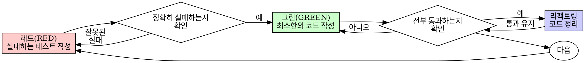

# 테스트 주도 개발 (Test-Driven Development, TDD)

## 개요

테스트를 먼저 작성하십시오. 테스트가 실패하는 것을 확인하십시오. 테스트를 통과하기 위한 최소한의 코드만 작성하십시오.

**핵심 원칙:** 테스트가 실패하는 것을 직접 보지 않았다면, 그 테스트가 올바른 것을 검증하고 있는지 알 수 없습니다.

**규칙의 문구(letter)를 어기는 것은 규칙의 본질(spirit)을 어기는 것과 같습니다.**

## 사용 시기

**항상 다음의 경우에 사용하십시오:**
- 새로운 기능 개발
- 버그 수정
- 리팩토링
- 동작 변경

**예외 사항 (사용자에게 허락을 구하십시오):**
- 일회성 프로토타입
- 자동 생성된 코드
- 설정 파일

"이번 한 번만 TDD를 건너뛸까?"라는 생각이 드십니까? 멈추십시오. 그것은 자기 합리화입니다.

## 철칙 (The Iron Law)

```
실패하는 테스트 없이는 프로덕션 코드를 작성하지 말 것
```

테스트보다 코드를 먼저 작성했습니까? 삭제하십시오. 그리고 다시 시작하십시오.

**예외는 없습니다:**
- "참고용"으로 남겨두지 마십시오.
- 테스트를 짜면서 코드를 "수정"하려 하지 마십시오.
- 작성했던 코드를 쳐다보지도 마십시오.
- 삭제는 완전한 삭제를 의미합니다.

테스트로부터 새롭게 구현하십시오. 그게 전부입니다.

## 레드-그린-리팩토링 (Red-Green-Refactor)



### 레드(RED) - 실패하는 테스트 작성

수행되어야 할 동작을 보여주는 최소한의 테스트 하나를 작성하십시오.

<좋은 예>
```typescript
test('실패한 작업을 3번 재시도한다', async () => {
  let attempts = 0;
  const operation = () => {
    attempts++;
    if (attempts < 3) throw new Error('fail');
    return 'success';
  };

  const result = await retryOperation(operation);

  expect(result).toBe('success');
  expect(attempts).toBe(3);
});
```
이름이 명확하고, 실제 동작을 테스트하며, 한 가지에 집중함
</좋은 예>

<나쁜 예>
```typescript
test('재시도가 작동함', async () => {
  const mock = jest.fn()
    .mockRejectedValueOnce(new Error())
    .mockRejectedValueOnce(new Error())
    .mockResolvedValueOnce('success');
  await retryOperation(mock);
  expect(mock).toHaveBeenCalledTimes(3);
});
```
이름이 모호하고, 코드가 아닌 모의 객체(mock)를 테스트함
</나쁜 예>

**요구 사항:**
- 하나의 동작에 집중
- 명확한 이름
- 실제 코드 사용 (피할 수 없는 경우에만 모의 객체 사용)

### 레드 확인 (Verify RED) - 실패하는 모습 지켜보기

**필수 사항입니다. 절대 건너뛰지 마십시오.**

```bash
npm test path/to/test.test.ts
```

다음을 확인하십시오:
- 테스트가 실패함 (에러가 발생하는 것이 아님)
- 실패 메시지가 예상과 일치함
- 기능이 구현되지 않았기 때문에 실패함 (오타 때문이 아님)

**테스트가 통과합니까?** 기존 동작을 테스트하고 있는 것입니다. 테스트를 수정하십시오.

**테스트에서 에러가 납니까?** 에러를 고치고 올바르게 실패할 때까지 다시 실행하십시오.

### 그린(GREEN) - 최소한의 코드 작성

테스트를 통과하기 위한 가장 단순한 코드를 작성하십시오.

<좋은 예>
```typescript
async function retryOperation<T>(fn: () => Promise<T>): Promise<T> {
  for (let i = 0; i < 3; i++) {
    try {
      return await fn();
    } catch (e) {
      if (i === 2) throw e;
    }
  }
  throw new Error('unreachable');
}
```
통과하기에 딱 충분한 코드
</좋은 예>

<나쁜 예>
```typescript
async function retryOperation<T>(
  fn: () => Promise<T>,
  options?: {
    maxRetries?: number;
    backoff?: 'linear' | 'exponential';
    onRetry?: (attempt: number) => void;
  }
): Promise<T> {
  // YAGNI (지금 필요 없는 기능)
}
```
과잉 엔지니어링
</나쁜 예>

테스트 범위를 넘어서는 기능을 추가하거나, 다른 코드를 리팩토링하거나, "개선"하려 하지 마십시오.

### 그린 확인 (Verify GREEN) - 통과하는 모습 지켜보기

**필수 사항입니다.**

```bash
npm test path/to/test.test.ts
```

다음을 확인하십시오:
- 테스트가 통과함
- 다른 테스트들도 여전히 통과함
- 출력이 깔끔함 (에러나 경고 없음)

**테스트가 실패합니까?** 테스트가 아니라 코드를 고치십시오.

**다른 테스트가 실패합니까?** 지금 바로 고치십시오.

### 리팩토링(REFACTOR) - 코드 정리

그린 단계 이후에만 수행하십시오:
- 중복 제거
- 이름 개선
- 헬퍼 함수 추출

테스트 통과 상태를 유지하십시오. 새로운 동작을 추가하지 마십시오.

### 반복

다음 기능을 위한 다음 실패 테스트로 넘어가십시오.

## 좋은 테스트의 기준

| 품질 | 좋은 예 | 나쁜 예 |
|---------|------|-----|
| **최소성** | 한 가지만 테스트함. 이름에 "and"가 들어간다면 분리하십시오. | `test('이메일과 도메인과 공백을 검증한다')` |
| **명확성** | 이름이 동작을 설명함 | `test('test1')` |
| **의도 표출** | 원하는 API 형태를 보여줌 | 코드가 무엇을 해야 하는지 가림 |

## 순서가 중요한 이유

**"코드를 먼저 짜고 나중에 잘 작동하는지 테스트할게요"**

코드를 먼저 작성한 후에 테스트를 만들면 즉시 통과해 버립니다. 즉시 통과하는 것은 아무것도 증명하지 못합니다:
- 엉뚱한 것을 테스트하고 있을지도 모릅니다.
- 동작이 아니라 구현 방식을 테스트하고 있을 수 있습니다.
- 잊어버린 예외 케이스를 놓칠 수 있습니다.
- 테스트가 실제로 버그를 잡아내는 것을 본 적이 없습니다.

테스트를 먼저 작성하면 테스트가 실패하는 것을 보게 되며, 이는 테스트가 무언가를 실제로 검증하고 있음을 증명합니다.

**"이미 수동으로 모든 예외 케이스를 확인했어요"**

수동 테스트는 즉흥적입니다. 여러분은 모든 것을 테스트했다고 생각하지만:
- 무엇을 테스트했는지 기록이 남지 않습니다.
- 코드가 바뀔 때마다 다시 실행하기 어렵습니다.
- 압박을 받으면 케이스를 잊어버리기 쉽습니다.
- "내가 해봤을 땐 됐어"라는 말이 포괄적인 테스트를 대신할 수 없습니다.

자동화된 테스트는 체계적입니다. 매번 동일한 방식으로 실행됩니다.

**"X시간 동안 작업한 걸 지우는 건 낭비예요"**

매몰 비용의 오류(Sunk cost fallacy)입니다. 시간은 이미 지나갔습니다. 이제 여러분의 선택은:
- 삭제하고 TDD로 다시 작성 (X시간 추가 소요, 높은 신뢰도)
- 그대로 두고 나중에 테스트 추가 (30분 소요, 낮은 신뢰도, 버그 가능성 높음)

진정한 "낭비"는 믿을 수 없는 코드를 유지하는 것입니다. 실제 테스트 없는 작동 코드는 기술 부채일 뿐입니다.

**"TDD는 교조적이에요. 실용적이라는 건 상황에 맞추는 거죠"**

TDD야말로 실용적입니다:
- 커밋 전에 버그를 찾습니다 (나중에 디버깅하는 것보다 빠름).
- 회귀 버그(Regression)를 방지합니다 (변경 사항이 기존 기능을 깨뜨리면 즉시 발견).
- 동작을 문서화합니다 (테스트 코드가 사용법을 보여줌).
- 리팩토링을 가능하게 합니다 (자유롭게 코드를 바꾸고 테스트로 검증).

"실용적"이라는 핑계로 지름길을 택하는 것 = 프로덕션에서 디버깅하게 됨 = 결과적으로 더 느려짐.

**"테스트를 나중에 짜도 목표는 같으니, 형식보다는 정신이 중요하죠"**

아니오. 사후 테스트는 "이게 무엇을 하는가?"에 답하지만, 선행 테스트(TDD)는 "이게 무엇을 **해야 하는가?**"에 답합니다.

사후 테스트는 여러분의 구현 방식에 편향됩니다. 요구 사항이 아니라 여러분이 구축한 것 위주로 테스트하게 됩니다. 발견된 예외 케이스가 아니라 기억나는 케이스만 확인하게 됩니다.

TDD는 구현 전에 예외 케이스를 발견하게 강제합니다. 사후 테스트는 여러분이 모든 걸 기억했는지만 확인합니다 (하지만 대개 다 기억하지 못합니다).

사후에 30분간 테스트를 짜는 것은 TDD가 아닙니다. 테스트 커버리지는 얻을지 몰라도, 테스트가 제대로 작동한다는 증거는 잃게 됩니다.

## 흔한 합리화

| 변명 | 현실 |
|--------|---------|
| "테스트하기엔 너무 단순해요" | 단순한 코드도 깨집니다. 테스트 작성은 30초면 충분합니다. |
| "나중에 테스트할게요" | 즉시 통과하는 테스트는 아무것도 증명하지 못합니다. |
| "나중에 짜도 목표는 같아요" | 사후 테스트 = "이게 뭘 하지?", TDD = "이게 뭘 해야 하지?" |
| "이미 수동으로 다 해봤어요" | 즉흥적(ad-hoc) 방식은 체계적이지 않습니다. 기록도 없고 재현도 어렵습니다. |
| "X시간 작업한 걸 지우는 건 손해예요" | 매몰 비용의 오류입니다. 검증되지 않은 코드를 남기는 것이 기술 부채입니다. |
| "참고용으로 두고 테스트부터 짤게요" | 결국 그 코드를 응용하게 됩니다. 그건 사후 테스트입니다. 삭제는 완전한 삭제입니다. |
| "먼저 탐색이 필요해요" | 좋습니다. 탐색 코드는 버리고, 다시 TDD로 시작하십시오. |
| "테스트가 너무 어려워요" | 설계가 불확실하다는 뜻입니다. 테스트하기 어려우면 사용하기도 어렵습니다. |
| "TDD는 속도를 늦춰요" | TDD가 나중에 디버깅하는 것보다 빠릅니다. 진짜 실용은 TDD입니다. |
| "수동 테스트가 더 빨라요" | 수동 테스트는 예외 케이스를 증명하지 못하며, 변경할 때마다 매번 다시 해야 합니다. |
| "기존 코드에 테스트가 없어요" | 여러분이 개선하고 있는 중입니다. 기존 코드에도 테스트를 추가하십시오. |

## 주의 신호 (Red Flags) - 즉시 중단하고 다시 시작하십시오

- 테스트보다 코드가 먼저 나옴
- 구현 후에 테스트 추가
- 테스트가 즉시 통과함
- 테스트가 왜 실패했는지 설명하지 못함
- 테스트를 "나중에" 추가함
- "이번 한 번만"이라고 합리화함
- "이미 수동으로 테스트했어"
- "나중에 짜도 목적은 같아"
- "형식보다 정신이 중요해"
- "참고용으로 남겨둘게" 또는 "기존 코드를 응용할게"
- "이미 여러 시간 작업했으니 지우는 건 낭비야"
- "TDD는 교조적이야, 난 실용적으로 할래"
- "이건 예외적인 상황이야, 왜냐하면..."

**이 모든 것은: 코드를 삭제하고 TDD로 다시 시작하라는 뜻입니다.**

## 예시: 버그 수정

**버그:** 빈 이메일 주소가 허용됨

**레드 (RED)**
```typescript
test('빈 이메일 주소를 거부한다', async () => {
  const result = await submitForm({ email: '' });
  expect(result.error).toBe('이메일이 필요합니다');
});
```

**레드 확인 (Verify RED)**
```bash
$ npm test
FAIL: expected '이메일이 필요합니다', got undefined
```

**그린 (GREEN)**
```typescript
function submitForm(data: FormData) {
  if (!data.email?.trim()) {
    return { error: '이메일이 필요합니다' };
  }
  // ...
}
```

**그린 확인 (Verify GREEN)**
```bash
$ npm test
PASS
```

**리팩토링 (REFACTOR)**
필요하다면 여러 필드에 대한 검증 로직을 추출합니다.

## 최종 확인 체크리스트

작업을 완료하기 전에 확인하십시오:

- [ ] 모든 새로운 함수/메서드에 대한 테스트가 있는가?
- [ ] 구현 전에 각 테스트가 실패하는 것을 지켜보았는가?
- [ ] 각 테스트가 예상한 원인(오타가 아닌 기능 부재)으로 실패했는가?
- [ ] 각 테스트를 통과하기 위한 최소한의 코드만 작성했는가?
- [ ] 모든 테스트가 통과하는가?
- [ ] 출력이 깔끔한가? (에러, 경고 없음)
- [ ] 테스트가 실제 코드를 사용하는가? (피할 수 없는 경우에만 모의 객체 사용)
- [ ] 예외 케이스와 에러 상황이 다루어졌는가?

하나라도 체크하지 못했다면 TDD를 건너뛴 것입니다. 다시 시작하십시오.

## 문제가 생겼을 때

| 문제상황 | 해결책 |
|---------|----------|
| 어떻게 테스트할지 모름 | 원하는 API 형태를 먼저 적어보십시오. 단언(assertion)을 먼저 써보십시오. 사용자에게 도움을 요청하십시오. |
| 테스트가 너무 복잡함 | 설계가 복잡하다는 뜻입니다. 인터페이스를 단순화하십시오. |
| 모든 것을 모의 객체화해야 함 | 결합도가 너무 높습니다. 의존성 주입(Dependency Injection)을 사용하십시오. |
| 테스트 설정이 너무 방대함 | 헬퍼 함수를 추출하십시오. 그래도 복잡하다면 설계를 단순화하십시오. |

## 디버깅 통합

버그를 발견했습니까? 이를 재현하는 실패 테스트를 작성하십시오. TDD 사이클을 따르십시오. 테스트는 수정을 증명하고 회귀 버그를 방지합니다.

테스트 없이는 절대로 버그를 수정하지 마십시오.

## 테스팅 안티 패턴

모의 객체나 테스트 유틸리티를 추가할 때는 공통적인 실수를 피하기 위해 @testing-anti-patterns.md를 읽으십시오:
- 실제 동작이 아닌 모의 객체의 동작을 테스트하는 경우
- 프로덕션 클래스에 테스트용 메서드를 추가하는 경우
- 의존성을 이해하지 못한 채 모킹하는 경우

## 최종 규칙

```
프로덕션 코드 → 테스트가 존재하며 먼저 실패했어야 함
그렇지 않다면 → TDD가 아님
```

사용자의 허락 없이는 어떠한 예외도 없습니다.
