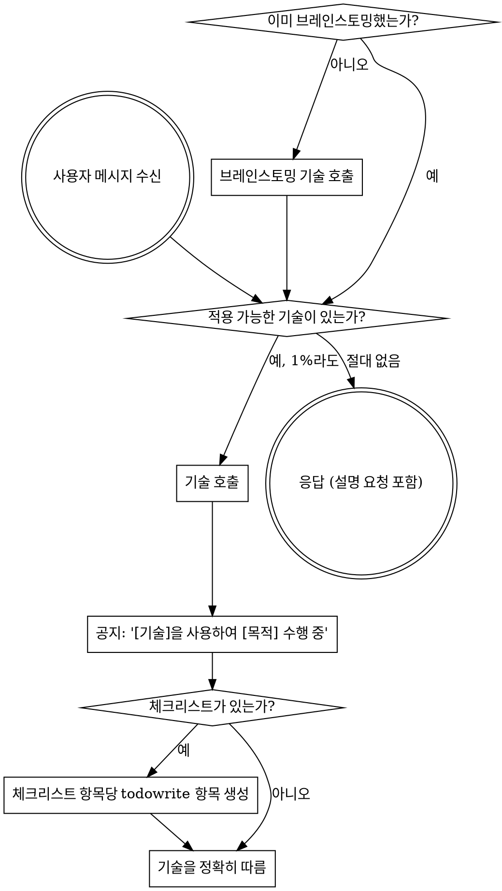

<SUBAGENT-STOP>
특정 작업을 실행하기 위해 서브에이전트로 파견된 경우, 이 기술을 건너뛰십시오.
</SUBAGENT-STOP>

<EXTREMELY-IMPORTANT>
수행 중인 작업에 기술이 적용될 가능성이 1%라도 있다고 생각되면, 반드시 해당 기술을 호출해야 합니다.

작업에 기술이 적용된다면, 선택의 여지가 없습니다. 반드시 사용해야 합니다.

이것은 협상의 대상이 아니며 선택 사항도 아닙니다. 이를 회피하기 위한 어떠한 합리화도 허용되지 않습니다.
</EXTREMELY-IMPORTANT>

## 지침 우선순위

슈퍼파워 기술은 기본 시스템 동작보다 우선하지만, **사용자 지침이 항상 최우선입니다**:

1. **사용자의 명시적 지침** (`AGENTS.md`, 직접적인 요청, 프로젝트별 지침) — 최우선 순위
2. **슈퍼파워 기술** — 충돌이 발생하는 경우 기본 시스템 동작보다 우선함
3. **기본 시스템 동작** — 가장 낮은 순위

만약 `AGENTS.md`나 사용자가 "TDD를 사용하지 마세요"라고 하고 기술에서 "항상 TDD를 사용하세요"라고 한다면, 사용자의 지침을 따르십시오. 사용자가 제어권을 가집니다.

## 기술에 접속하는 방법

OpenCode의 기본 `skill` 도구를 사용하십시오.

기술을 호출하면 해당 내용이 로드되어 대화로 반환됩니다. 이를 직접 따르십시오.

워크플로우에서 명시적으로 요구하지 않는 한 기술 파일을 일반 프로젝트 파일로 취급하지 마십시오.

## OpenCode 도구 적응

기술이 플랫폼별 도구 이름을 참조할 때 OpenCode 대응 도구를 사용하십시오:

- `Skill` 도구 -> OpenCode 기본 `skill`
- `TodoWrite` -> `todowrite`
- `Read`, `Write`, `Edit`, `Bash` -> OpenCode 기본 도구
- 기술이 OpenCode에서 직접 제공하지 않는 도구를 언급하는 경우, 이름을 그대로 복사하는 대신 워크플로우를 가장 가까운 OpenCode 기본 메커니즘에 맞게 조정하십시오.

# 기술 사용하기

## 규칙

**응답이나 조치를 취하기 전에 관련 있거나 요청된 기술을 호출하십시오.** 기술이 적용될 가능성이 1%라도 있다면 기술을 호출하여 확인해야 합니다. 호출된 기술이 상황에 맞지 않는 것으로 판명되면 사용하지 않아도 됩니다.

## 주의 신호 (Red Flags)

다음과 같은 생각은 멈춰야 한다는 신호입니다—합리화하고 있는 것입니다:

| 생각 | 현실 |
|---------|---------|
| "단순한 질문일 뿐이야" | 질문도 작업입니다. 기술이 있는지 확인하세요. |
| "먼저 상황 파악이 더 필요해" | 기술 확인은 설명을 요청하기 전에 이루어져야 합니다. |
| "코드베이스를 먼저 살펴봐야지" | 기술은 탐색하는 "방법"을 알려줍니다. 먼저 확인하세요. |
| "git/파일을 빨리 확인할 수 있어" | 파일에는 대화의 맥락이 부족합니다. 기술을 확인하세요. |
| "정보를 먼저 수집하자" | 기술은 정보를 수집하는 "방법"을 알려줍니다. |
| "이건 정식 기술이 필요 없어" | 기술이 존재한다면 사용하세요. |
| "이 기술 기억나" | 기술은 진화합니다. 현재 버전을 읽으세요. |
| "이건 작업이라고 볼 수 없어" | 조치 = 작업입니다. 기술을 확인하세요. |
| "기술을 쓰는 게 과해" | 단순한 일이 복잡해질 수 있습니다. 사용하세요. |
| "딱 이것만 먼저 할게" | 무엇이든 하기 전에 확인하세요. |
| "이게 생산적인 것 같아" | 규율 없는 조치는 시간을 낭비합니다. 기술은 이를 방지합니다. |
| "그게 무슨 뜻인지 알아" | 개념을 아는 것과 기술을 사용하는 것은 다릅니다. 호출하세요. |

## 기술 우선순위

여러 기술이 적용될 수 있는 경우 다음 순서를 따르십시오:

1. **프로세스 기술 우선** (brainstorming, debugging) - 작업을 어떻게 진행할지 결정합니다.
2. **구현 기술 다음** (frontend-design, mcp-builder) - 실행을 가이드합니다.

"X를 만들자" → 브레인스토밍 먼저, 그 다음 구현 기술.
"이 버그를 고치자" → 디버깅 먼저, 그 다음 도메인 특정 기술.

## 기술 유형

**엄격 (Rigid)** (TDD, debugging): 정확히 따르십시오. 규율을 벗어나지 마십시오.

**유연 (Flexible)** (patterns): 상황에 맞게 원칙을 적용하십시오.

기술 자체에서 어떤 유형인지 알려줍니다.

## 사용자 지침

지침은 "방법"이 아니라 "무엇"을 말합니다. "X 추가" 또는 "Y 수정"이 워크플로우를 건너뛰라는 의미는 아닙니다.
