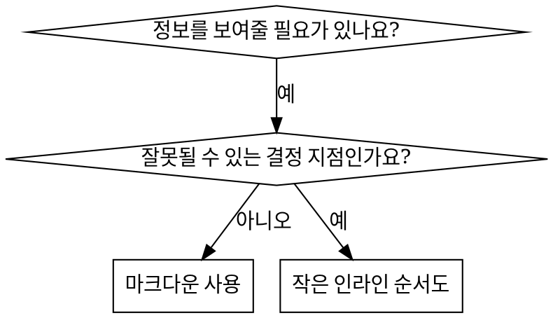

# 기술 작성법 (Writing Skills)

## 개요

**기술을 작성하는 것은 프로세스 문서화에 테스트 주도 개발(TDD)을 적용하는 것과 같습니다.**

**개인적인 기술은 에이전트 전용 디렉토리에 저장됩니다 (Claude Code의 경우 `~/.claude/skills`, Codex의 경우 `~/.agents/skills/`).**

테스트 케이스(서브에이전트를 활용한 압박 시나리오)를 작성하고, 실패하는 것을 확인하며(기본 동작), 기술(문서)을 작성하고, 테스트가 통과하는 것을 확인하고(에이전트 준수), 리팩토링(허점 보완)하는 과정을 거칩니다.

**핵심 원칙:** 해당 기술 없이 에이전트가 실패하는 것을 직접 보지 않았다면, 그 기술이 올바른 내용을 가르치고 있는지 알 수 없습니다.

**필수 배경 지식:** 이 기술을 사용하기 전에 반드시 **superpowers:test-driven-development**를 이해해야 합니다. 해당 기술은 기본적인 레드-그린-리팩토링 사이클을 정의합니다. 본 기술은 TDD를 문서화에 맞게 변형한 것입니다.

**공식 가이드:** Anthropic의 공식 기술 작성 모범 사례는 `anthropic-best-practices.md`를 참조하십시오. 해당 문서는 이 기술의 TDD 중심 접근 방식을 보완하는 추가적인 패턴과 가이드라인을 제공합니다.

## 기술(Skill)이란 무엇인가?

**기술(Skill)**은 검증된 기법, 패턴 또는 도구에 대한 참조 가이드입니다. 기술은 미래의 Claude 인스턴스가 효과적인 접근 방식을 찾고 적용하는 데 도움을 줍니다.

**기술은 다음과 같습니다:** 재사용 가능한 기법, 패턴, 도구, 참조 가이드

**기술이 아닌 것은 다음과 같습니다:** 한 번 문제를 어떻게 해결했는지에 대한 이야기(narrative)

## 기술 생성을 위한 TDD 매핑

| TDD 개념 | 기술 생성 |
|-------------|----------------|
| **테스트 케이스** | 서브에이전트를 활용한 압박 시나리오 |
| **프로덕션 코드** | 기술 문서 (SKILL.md) |
| **테스트 실패 (RED)** | 기술 없이 에이전트가 규칙을 위반함 (기준선) |
| **테스트 통과 (GREEN)** | 기술이 있을 때 에이전트가 규칙을 준수함 |
| **리팩토링** | 준수 상태를 유지하면서 허점을 보완함 |
| **테스트 먼저 작성** | 기술을 작성하기 전에 기준선 시나리오를 실행함 |
| **실패 지켜보기** | 에이전트가 사용하는 정확한 자기 합리화 논리를 기록함 |
| **최소한의 코드** | 해당 특정 위반 사항을 해결하는 기술을 작성함 |
| **통과 지켜보기** | 에이전트가 이제 규칙을 준수하는지 검증함 |
| **리팩토링 사이클** | 새로운 자기 합리화 발견 → 보완 → 재검증 |

기술 생성의 전체 프로세스는 레드-그린-리팩토링을 따릅니다.

## 기술을 생성해야 하는 경우

**다음의 경우 생성하십시오:**
- 기법이 직관적으로 명확하지 않았을 때
- 이 내용을 다른 프로젝트에서도 다시 참조할 것 같을 때
- 패턴이 광범위하게 적용될 때 (프로젝트 전용이 아님)
- 다른 사람들에게 도움이 될 때

**다음의 경우 생성하지 마십시오:**
- 일회성 해결책
- 다른 곳에 이미 잘 문서화된 표준 관행
- 프로젝트 전용 컨벤션 (CLAUDE.md에 작성하십시오)
- 기계적인 제약 사항 (정규식/검증으로 강제할 수 있다면 문서를 만들기보다 자동화하십시오. 문서는 판단이 필요한 부분을 위해 아껴두십시오.)

## 기술 유형

### 기법 (Technique)
따라야 할 단계가 있는 구체적인 방법 (condition-based-waiting, root-cause-tracing)

### 패턴 (Pattern)
문제를 생각하는 방식 (flatten-with-flags, test-invariants)

### 참조 (Reference)
API 문서, 구문 가이드, 도구 문서 (office docs)

## 디렉토리 구조

```
skills/
  skill-name/
    SKILL.md              # 메인 참조 문서 (필수)
    supporting-file.*     # 필요한 경우에만 추가
```

**평면적 네임스페이스(Flat namespace)** - 모든 기술은 검색 가능한 하나의 네임스페이스 안에 위치합니다.

**별도 파일로 분리하는 경우:**
1. **방대한 참조 내용** (100줄 이상) - API 문서, 포괄적인 구문 가이드
2. **재사용 가능한 도구** - 스크립트, 유틸리티, 템플릿

**인라인(SKILL.md 안에 작성)으로 유지하는 내용:**
- 원칙과 개념
- 코드 패턴 (50줄 미만)
- 그 밖의 모든 것

## SKILL.md 구조

**프론트매터 (YAML):**
- 두 개의 필수 필드: `name` 및 `description` (지원되는 모든 필드는 [agentskills.io/specification](https://agentskills.io/specification) 참조)
- 총 1024자 이내
- `name`: 영문자, 숫자, 하이픈만 사용 (괄호나 특수 문자 불가)
- `description`: 3인칭으로 작성하며, **언제** 사용하는지만 설명 (무엇을 하는지 설명하지 않음)
  - 실행 조건에 집중하기 위해 "다음의 경우에 사용..."(Use when...)으로 시작하십시오.
  - 특정 증상, 상황, 문맥을 포함하십시오.
  - **절대로 기술의 프로세스나 워크플로우를 요약하지 마십시오** (이유는 아래 CSO 섹션 참조).
  - 가능하면 500자 이내로 유지하십시오.

```markdown
---
name: Skill-Name-With-Hyphens
description: [특정 실행 조건 및 증상]이 발생하는 경우에 사용
---

# 기술 이름 (Skill Name)

## 개요 (Overview)
이것은 무엇입니까? 핵심 원칙을 1~2문장으로 설명합니다.

## 사용 시기 (When to Use)
[결정이 직관적이지 않은 경우 작은 인라인 순서도 포함]

증상 및 사용 사례 목록
사용하지 말아야 할 때

## 핵심 패턴 (Core Pattern - 기법/패턴인 경우)
코드 전/후 비교

## 빠른 참조 (Quick Reference)
일반적인 작업을 훑어볼 수 있는 표 또는 목록

## 구현 (Implementation)
단순한 패턴의 경우 인라인 코드 작성
방대한 참조나 재사용 도구의 경우 파일 링크 제공

## 흔한 실수 (Common Mistakes)
잘못되는 경우와 해결법

## 실제 사례 영향 (Real-World Impact - 선택 사항)
구체적인 결과물
```

## Claude 검색 최적화 (CSO)

**발견을 위해 매우 중요:** 미래의 Claude가 여러분의 기술을 찾아낼 수 있어야 합니다.

### 1. 풍부한 설명(Description) 필드

**목적:** Claude는 설명을 읽고 특정 작업에 어떤 기술을 로드할지 결정합니다. "지금 이 기술을 읽어야 하는가?"라는 질문에 답할 수 있게 하십시오.

**형식:** 실행 조건에 집중하기 위해 "다음의 경우에 사용..."(Use when...)으로 시작하십시오.

**중요: 설명 = 사용 시기, 기술이 하는 일 요약이 아님**

설명은 오직 실행 조건만을 기술해야 합니다. 설명에 기술의 프로세스나 워크플로우를 요약하지 마십시오.

**이것이 중요한 이유:** 테스트 결과, 설명이 기술의 워크플로우를 요약하고 있으면 Claude가 전체 기술 내용을 읽는 대신 설명을 그대로 따라 할 수 있다는 것이 밝혀졌습니다. 예를 들어 설명이 "작업 사이의 코드 리뷰"라고 되어 있으면, 기술의 순서도가 명확히 2단계 리뷰(사양 준수 후 코드 품질)를 보여줌에도 불구하고 Claude는 단 한 번의 리뷰만 수행했습니다.

설명을 단순히 "독립적인 작업이 포함된 구현 계획을 실행할 때 사용"으로 변경하자(워크플로우 요약 없음), Claude는 순서도를 정확히 읽고 2단계 리뷰 프로세스를 따랐습니다.

**함정:** 워크플로우를 요약하는 설명은 Claude가 선택하게 되는 지름길을 만듭니다. 기술 본문은 Claude가 건너뛰는 문서가 되어버립니다.

```yaml
# ❌ 나쁜 예: 워크플로우 요약 - Claude가 기술을 읽는 대신 이것을 따를 수 있음
description: 구현 계획 실행 시 사용 - 태스크별로 서브에이전트를 파견하고 태스크 사이에 코드 리뷰를 수행함

# ❌ 나쁜 예: 너무 상세한 프로세스 설명
description: TDD를 위해 사용 - 테스트를 먼저 짜고, 실패를 확인하고, 최소 코드를 짜고, 리팩토링함

# ✅ 좋은 예: 워크플로우 요약 없이 실행 조건만 기술
description: 현재 세션에서 독립적인 작업들이 포함된 구현 계획을 실행할 때 사용

# ✅ 좋은 예: 실행 조건만 기술
description: 기능 구현이나 버그 수정을 시작할 때, 실제 구현 코드를 작성하기 전에 사용
```

### 2. 키워드 커버리지

Claude가 검색할 만한 단어들을 사용하십시오:
- 에러 메시지: "Hook timed out", "ENOTEMPTY", "race condition"
- 증상: "flaky", "hanging", "zombie", "pollution"
- 동의어: "timeout/hang/freeze", "cleanup/teardown/afterEach"
- 도구: 실제 명령어, 라이브러리 이름, 파일 유형

### 3. 설명적인 이름 짓기

**능동태를 사용하고 동사를 먼저 배치하십시오:**
- ✅ `creating-skills` (기술 생성하기) - `skill-creation` 지양
- ✅ `condition-based-waiting` (조건 기반 대기) - `async-test-helpers` 지양

### 4. 토큰 효율성 (매우 중요)

**목적:** `getting-started` 워크플로우나 자주 참조되는 기술들은 **모든** 대화에 로드됩니다. 모든 토큰이 비용입니다.

**목표 단어 수:**
- `getting-started` 워크플로우: 각각 150단어 미만
- 자주 로드되는 기술: 전체 200단어 미만
- 기타 기술: 500단어 미만 (여전히 간결해야 함)

**기법:**

**상세한 내용은 도구의 --help로 넘기십시오:**
```bash
# ❌ 나쁜 예: SKILL.md에 모든 플래그를 문서화함
search-conversations는 --text, --both, --after DATE, --before DATE, --limit N을 지원합니다.

# ✅ 좋은 예: --help 참조
search-conversations는 다양한 모드와 필터를 지원합니다. 자세한 내용은 --help를 실행하십시오.
```

**교차 참조(Cross-reference) 활용:**
```markdown
# ❌ 나쁜 예: 워크플로우 세부 사항 반복
검색할 때 템플릿과 함께 서브에이전트를 파견하십시오...
[20줄의 반복된 지침]

# ✅ 좋은 예: 다른 기술 참조
항상 서브에이전트를 사용하십시오 (컨텍스트 50~100배 절약). **필수:** 워크플로우를 위해 [다른 기술 이름]을 사용하십시오.
```

**예시 압축:**
```markdown
# ❌ 나쁜 예: 장황한 예시 (42단어)
사용자: "이전에 React Router에서 인증 에러를 어떻게 처리했었지?"
여러분: 과거 대화에서 React Router 인증 패턴을 검색해 보겠습니다.
[검색 쿼리와 함께 서브에이전트 파견: "React Router authentication error handling 401"]

# ✅ 좋은 예: 최소한의 예시 (20단어)
사용자: "React Router에서 인증 에러 어떻게 처리했어?"
여러분: 검색 중...
[서브에이전트 파견 → 요약 보고]
```

**중복 제거:**
- 교차 참조된 기술에 있는 내용을 반복하지 마십시오.
- 명령어를 통해 명확히 알 수 있는 내용을 설명하지 마십시오.
- 동일한 패턴에 대해 여러 개의 예시를 넣지 마십시오.

**검증:**
```bash
wc -w skills/path/SKILL.md
# getting-started 워크플로우: 각각 150단어 미만 지향
# 기타 자주 로드되는 기술: 전체 200단어 미만 지향
```

**수행하는 동작이나 핵심 통찰로 이름을 지으십시오:**
- ✅ `condition-based-waiting` > `async-test-helpers`
- ✅ `using-skills` (기술 사용하기) - `skill-usage` 지양
- ✅ `flatten-with-flags` > `data-structure-refactoring`
- ✅ `root-cause-tracing` > `debugging-techniques`

**동명사(-ing) 형태는 프로세스 설명에 좋습니다:**
- `creating-skills`, `testing-skills`, `debugging-with-logs`
- 능동적이며 여러분이 취하는 행동을 설명합니다.

### 4. 다른 기술 교차 참조

**다른 기술을 참조하는 문서를 작성할 때:**

명시적인 요구 사항 마커와 함께 기술 이름만 사용하십시오:
- ✅ 좋은 예: `**필수 하위 기술:** superpowers:test-driven-development를 사용하십시오`
- ✅ 좋은 예: `**필수 배경 지식:** superpowers:systematic-debugging을 반드시 이해해야 합니다`
- ❌ 나쁜 예: `skills/testing/test-driven-development를 참조하십시오` (필수 여부가 불분명함)
- ❌ 나쁜 예: `@skills/testing/test-driven-development/SKILL.md` (강제로 로드되어 컨텍스트를 낭비함)

**왜 @ 링크를 쓰지 않는가:** `@` 구문은 파일을 즉시 강제로 로드하여 필요하기도 전에 200k 이상의 컨텍스트를 소모해 버립니다.

## 순서도(Flowchart) 사용법



**순서도는 다음의 경우에만 사용하십시오:**
- 직관적이지 않은 결정 지점
- 너무 일찍 멈출 수 있는 프로세스 루프
- "A를 쓸 것인가 B를 쓸 것인가"에 대한 결정

**절대로 다음의 경우에 순서도를 사용하지 마십시오:**
- 참조 자료 → 표, 목록 사용
- 코드 예시 → 마크다운 블록 사용
- 선형 지시 사항 → 번호 매기기 목록 사용
- 의미 없는 레이블 사용 (step1, helper2 등)

Graphviz 스타일 규칙은 `@graphviz-conventions.dot`을 참조하십시오.

**사용자에게 시각화하여 보여주기:** 이 디렉토리의 `render-graphs.js`를 사용하여 기술의 순서도를 SVG로 렌더링할 수 있습니다:
```bash
./render-graphs.js ../some-skill           # 각 다이어그램을 별도로 렌더링
./render-graphs.js ../some-skill --combine # 모든 다이어그램을 하나의 SVG로 병합
```

## 코드 예시

**하나의 훌륭한 예시가 평범한 여러 개보다 낫습니다.**

가장 관련성 높은 언어를 선택하십시오:
- 테스트 기법 → TypeScript/JavaScript
- 시스템 디버깅 → Shell/Python
- 데이터 처리 → Python

**좋은 예시의 기준:**
- 완전하고 실행 가능함
- **왜(WHY)** 그렇게 했는지 설명하는 주석이 잘 달려 있음
- 실제 시나리오에서 가져옴
- 패턴을 명확하게 보여줌
- (범용 템플릿이 아니라) 즉시 응용 가능함

**하지 말아야 할 것:**
- 5개 이상의 언어로 구현하기
- 빈칸 채우기 식의 템플릿 만들기
- 억지로 꾸며낸 예시 작성하기

여러분은 포팅(Porting)에 능숙하므로, 하나의 훌륭한 예시면 충분합니다.

## 파일 구성

### 자체 포함 기술 (Self-Contained Skill)
```
defense-in-depth/
  SKILL.md    # 모든 내용을 인라인으로 작성
```
언제: 모든 내용이 한 파일에 들어가며, 방대한 참조가 필요 없을 때

### 도구가 포함된 기술 (Skill with Reusable Tool)
```
condition-based-waiting/
  SKILL.md    # 개요 + 패턴
  example.ts  # 응용 가능한 실제 헬퍼 코드
```
언제: 도구가 단순한 이야기가 아니라 재사용 가능한 코드일 때

### 방대한 참조가 포함된 기술 (Skill with Heavy Reference)
```
pptx/
  SKILL.md       # 개요 + 워크플로우
  pptxgenjs.md   # 600줄 분량의 API 참조
  ooxml.md       # 500줄 분량의 XML 구조
  scripts/       # 실행 가능한 도구들
```
언제: 참조 자료가 너무 커서 인라인으로 넣기 힘들 때

## 철칙 (TDD와 동일)

```
실패하는 테스트 없이는 기술을 작성하지 말 것
```

이 규칙은 **새로운** 기술뿐만 아니라 기존 기술을 **편집**할 때도 적용됩니다.

테스트 전에 기술을 작성했습니까? 삭제하십시오. 다시 시작하십시오.
테스트 없이 기술을 편집했습니까? 동일한 위반입니다.

**예외는 없습니다:**
- "간단한 추가"인 경우에도 안 됩니다.
- "섹션 하나만 더하는 것"도 안 됩니다.
- "문서 업데이트"도 안 됩니다.
- 검증되지 않은 변경 사항을 "참고용"으로 남겨두지 마십시오.
- 테스트를 실행하는 중에 "수정"하지 마십시오.
- 삭제는 완전한 삭제를 의미합니다.

**필수 배경 지식:** `superpowers:test-driven-development` 기술은 이것이 왜 중요한지 설명합니다. 문서화에도 동일한 원칙이 적용됩니다.

## 모든 유형의 기술 테스트하기

기술 유형에 따라 테스트 방식이 달라야 합니다:

### 규율 강제형 기술 (규칙/요구 사항)

**예시:** TDD, 완료 전 검증(verification-before-completion), 코딩 전 설계(designing-before-coding)

**테스트 방법:**
- 학술적 질문: 규칙을 이해하고 있는가?
- 압박 시나리오: 스트레스 상황에서도 규칙을 준수하는가?
- 복합 압박: 시간 + 매몰 비용 + 피로가 겹친 상황
- 자기 합리화 시도를 식별하고 명시적인 대응책 추가

**성공 기준:** 최대 압박 상황에서도 에이전트가 규칙을 준수함

### 기법 기술 (가이드북)

**예시:** condition-based-waiting, root-cause-tracing, 방어적 프로그래밍(defensive-programming)

**테스트 방법:**
- 적용 시나리오: 기법을 정확하게 적용할 수 있는가?
- 변형 시나리오: 예외 케이스를 처리할 수 있는가?
- 정보 누락 테스트: 지침에 빠진 부분은 없는가?

**성공 기준:** 에이전트가 새로운 시나리오에 기법을 성공적으로 적용함

### 패턴 기술 (사고 모델)

**예시:** 복잡성 줄이기(reducing-complexity), 정보 은닉(information-hiding) 개념

**테스트 방법:**
- 인식 시나리오: 패턴이 적용될 상황임을 알아차리는가?
- 적용 시나리오: 사고 모델을 사용할 수 있는가?
- 반대 사례: 적용하지 **말아야** 할 때를 아는가?

**성공 기준:** 에이전트가 패턴을 언제/어떻게 적용할지 정확히 식별함

### 참조 기술 (문서/API)

**예시:** API 문서, 명령어 참조, 라이브러리 가이드

**테스트 방법:**
- 정보 검색 시나리오: 올바른 정보를 찾을 수 있는가?
- 적용 시나리오: 찾은 내용을 정확하게 사용할 수 있는가?
- 공백 테스트: 일반적인 사용 사례가 포함되어 있는가?

**성공 기준:** 에이전트가 참조 정보를 찾아서 정확하게 적용함

## 테스트를 건너뛰기 위한 흔한 합리화

| 변명 | 현실 |
|--------|---------|
| "기술이 너무 명확해서 테스트가 필요 없어요" | 여러분에게 명확한 것이 다른 에이전트에게는 명확하지 않을 수 있습니다. 테스트하십시오. |
| "이건 그냥 참조용이에요" | 참조 자료에도 빠진 부분이나 불분명한 섹션이 있을 수 있습니다. 정보 검색을 테스트하십시오. |
| "테스트는 과해요" | 테스트되지 않은 기술은 항상 문제를 일으키습니다. 15분의 테스트가 수 시간을 아껴줍니다. |
| "문제가 생기면 그때 테스트할게요" | 문제가 생겼다는 건 에이전트가 기술을 사용하지 못했다는 뜻입니다. 배포 전에 테스트하십시오. |
| "테스트하기 너무 번거로워요" | 테스트하는 것이 나중에 배수진을 치고 나쁜 기술을 디버깅하는 것보다 덜 번거롭습니다. |
| "잘 만들었다고 확신해요" | 과도한 확신은 문제를 보장합니다. 그래도 테스트하십시오. |
| "학술적 검토만으로 충분해요" | 읽는 것과 사용하는 것은 다릅니다. 실제 적용 시나리오를 테스트하십시오. |
| "테스트할 시간이 없어요" | 테스트되지 않은 기술을 배포하면 나중에 이를 고치는 데 더 많은 시간이 낭비됩니다. |

**이 모든 것은: 배포 전 테스트를 수행하라는 뜻입니다. 예외는 없습니다.**

## 자기 합리화에 대비한 기술 보완 (Bulletproofing)

TDD와 같이 규율을 강제하는 기술은 자기 합리화에 저항할 수 있어야 합니다. 에이전트는 똑똑하며, 압박을 받을 때 허점을 찾아낼 것입니다.

**심리학 노트:** 설득 기법이 왜 작동하는지 이해하면 이를 체계적으로 적용하는 데 도움이 됩니다. 권위, 약속, 희소성, 사회적 증거, 일체감 원칙에 대한 연구 결과(Cialdini, 2021; Meincke et al., 2025)는 `persuasion-principles.md`를 참조하십시오.

### 모든 허점을 명시적으로 차단하십시오

단순히 규칙을 말하는 데 그치지 말고, 구체적인 우회 시도를 금지하십시오:

<나쁜 예>
```markdown
테스트보다 코드를 먼저 짰나요? 삭제하십시오.
```
</나쁜 예>

<좋은 예>
```markdown
테스트보다 코드를 먼저 짰나요? 삭제하고 다시 시작하십시오.

**예외는 없습니다:**
- "참고용"으로 남겨두지 마십시오.
- 테스트를 짜면서 코드를 "응용"하려 하지 마십시오.
- 쳐다보지도 마십시오.
- 삭제는 완전한 삭제를 의미합니다.
```
</좋은 예>

### "정신 vs 문구" 논쟁에 대응하십시오

기초적인 원칙을 앞부분에 추가하십시오:

```markdown
**규칙의 문구(letter)를 어기는 것은 규칙의 본질(spirit)을 어기는 것과 같습니다.**
```

이렇게 하면 "난 규칙의 본심을 따르고 있어"라는 식의 광범위한 합리화 시도를 차단할 수 있습니다.

### 자기 합리화 대응 표를 작성하십시오

기준선 테스트 과정에서 포착한 에이전트의 자기 합리화 논리를 표로 만드십시오 (아래 테스트 섹션 참조). 에이전트가 내뱉는 모든 변명을 표에 넣으십시오:

```markdown
| 변명 | 현실 |
|--------|---------|
| "테스트하기엔 너무 단순해요" | 단순한 코드도 깨집니다. 테스트 작성은 30초면 충분합니다. |
| "나중에 테스트할게요" | 즉시 통과하는 테스트는 아무것도 증명하지 못합니다. |
| "나중에 짜도 목표는 같아요" | 사후 테스트 = "이게 뭘 하지?", TDD = "이게 뭘 해야 하지?" |
```

### 주의 신호(Red Flags) 목록 작성

에이전트가 스스로 자기 합리화 중임을 깨달을 수 있게 하십시오:

```markdown
## 주의 신호 (Red Flags) - 즉시 중단하고 다시 시작하십시오

- 테스트보다 코드가 먼저 나옴
- "이미 수동으로 테스트했어"
- "나중에 짜도 목적은 같아"
- "형식보다 정신이 중요해"
- "이건 예외적인 상황이야, 왜냐하면..."

**이 모든 것은: 코드를 삭제하고 TDD로 다시 시작하라는 뜻입니다.**
```

### 위반 증상을 검색 설명(CSO)에 추가

설명 필드에 해당 규칙을 위반하기 **직전**의 증상을 추가하십시오:

```yaml
description: 기능 구현이나 버그 수정을 시작할 때, 실제 구현 코드를 작성하기 전에 사용
```

## 기술 작성을 위한 레드-그린-리팩토링

TDD 사이클을 따르십시오:

### 레드(RED): 실패 테스트 작성 (기준선 마련)

해당 기술 **없이** 서브에이전트와 함께 압박 시나리오를 실행하십시오. 그리고 정확한 동작을 기록하십시오:
- 그들은 어떤 선택을 했는가?
- 어떤 합리화 논리를 사용했는가 (토씨 하나 틀리지 않게)?
- 어떤 압박이 규칙 위반을 유발했는가?

이것이 "테스트가 실패하는 것을 지켜보는" 과정입니다. 기술을 작성하기 전에 에이전트가 자연 상태에서 어떻게 행동하는지 반드시 확인해야 합니다.

### 그린(GREEN): 최소한의 기술 작성

해당 특정 자기 합리화 논리를 해결하는 기술을 작성하십시오. 가상의 상황을 위해 불필요한 내용을 추가하지 마십시오.

기술과 함께 동일한 시나리오를 실행하십시오. 에이전트는 이제 규칙을 준수해야 합니다.

### 리팩토링(REFACTOR): 허점 보완

에이전트가 새로운 합리화 논리를 찾아냈습니까? 명시적인 대응책을 추가하십시오. 완벽해질 때까지 재테스트하십시오.

**테스트 방법론:** 완전한 테스트 방법론은 `testing-skills-with-subagents.md`를 참조하십시오:
- 압박 시나리오 작성법
- 압박 유형 (시간, 매몰 비용, 권위, 피로)
- 체계적으로 허점을 막는 법
- 메타 테스팅 기법

## 안티 패턴

### ❌ 이야기 식의 예제 (Narrative Example)
"2025-10-03 세션에서 빈 projectDir이 문제를 일으키는 것을 발견했습니다..."
**왜 나쁜가:** 너무 구체적이며 재사용성이 떨어집니다.

### ❌ 다중 언어로 인한 집중력 분산
example-js.js, example-py.py, example-go.go 등
**왜 나쁜가:** 품질이 떨어지고 유지보수 부담이 큽니다.

### ❌ 순서도 안의 코드
```dot
step1 [label="import fs"];
step2 [label="read file"];
```
**왜 나쁜가:** 복사하여 붙여넣을 수 없고 읽기 어렵습니다.

### ❌ 일반적이고 모호한 레이블
helper1, helper2, step3, pattern4
**왜 나쁜가:** 레이블에는 항상 의미 있는 이름이 있어야 합니다.

## 중단: 다음 기술로 넘어가기 전에

**어떠한 기술이라도 작성한 후에는 반드시 멈추고 배포 프로세스를 완료해야 합니다.**

**절대 하지 말아야 할 것:**
- 각 기술을 테스트하지 않은 채 여러 기술을 한꺼번에 생성하기
- 현재 기술이 검증되기 전에 다음 기술로 넘어가기
- "일괄 작업이 더 효율적"이라는 핑계로 테스트 건너뛰기

**아래의 배포 체크리스트는 각 기술마다 반드시 완료해야 합니다.**

테스트되지 않은 기술을 배포하는 것은 테스트되지 않은 코드를 배포하는 것과 같으며, 품질 기준 위반입니다.

## 기술 생성 체크리스트 (TDD 변형)

**중요: 아래 체크리스트의 각 항목에 대해 TodoWrite를 사용하여 할 일을 생성하십시오.**

**레드(RED) 단계 - 실패 테스트 작성:**
- [ ] 압박 시나리오 생성 (규율 관련 기술인 경우 3개 이상의 복합 압박)
- [ ] 기술 없이 시나리오 실행 - 기준선 동작을 있는 그대로 기록
- [ ] 자기 합리화/실패 패턴 식별

**그린(GREEN) 단계 - 최소한의 기술 작성:**
- [ ] 이름에 영문자, 숫자, 하이픈만 사용 (괄호/특수문자 없음)
- [ ] 필수 필드 `name`과 `description`이 포함된 YAML 프론트매터 작성 (최대 1024자, [사양](https://agentskills.io/specification) 참조)
- [ ] 설명(Description)은 "다음의 경우 사용..."으로 시작하며 구체적 트리거/증상 포함
- [ ] 설명은 3인칭으로 작성
- [ ] 검색을 위한 키워드 배치 (에러, 증상, 도구)
- [ ] 핵심 원칙이 포함된 명확한 개요
- [ ] 레드 단계에서 파악된 실제 실패 요인들을 해결함
- [ ] 코드 인라인 작성 또는 별도 파일 링크
- [ ] 하나의 훌륭한 예시 제공 (다중 언어 지양)
- [ ] 기술과 함께 시나리오 실행 - 준수 여부 검증

**리팩토링(REFACTOR) 단계 - 허점 보완:**
- [ ] 테스트를 통해 새로운 자기 합리화 시도 식별
- [ ] 명시적인 대응책 추가 (규능 관련 기술인 경우)
- [ ] 모든 테스트 반복 과정에서 수집된 자기 합리화 대응 표 구축
- [ ] 주의 신호(Red Flags) 목록 작성
- [ ] 완벽해질 때까지 재테스트

**품질 점검:**
- [ ] 직관적이지 않은 결정에 대해서만 작은 순서도 제공
- [ ] 빠른 참조 표 제공
- [ ] 흔한 실수 섹션 포함
- [ ] 이야기 식의 서술 지양
- [ ] 도구나 방대한 참조를 위해서만 보조 파일 사용

**배포:**
- [ ] 기술을 git에 커밋하고 포크(fork)로 푸시 (설정된 경우)
- [ ] 범용적으로 유용한 경우 PR을 통한 기여 고려

## 발견 워크플로우

미래의 Claude가 여러분의 기술을 찾는 방법:

1. **문제 봉착** ("테스트가 불안정함")
2. **기술 발견** (설명이 일치함)
3. **개요 훑어보기** (관련이 있는가?)
4. **패턴 읽기** (빠른 참조 표 확인)
5. **예시 로드** (구현 시에만)

**이 흐름에 최적화하십시오** - 검색 가능한 용어를 앞부분에 자주 배치하십시오.

## 결론

**기술을 작성하는 것은 프로세스 문서화를 위한 TDD입니다.**

동일한 철칙: 실패하는 테스트 없이는 기술을 작성하지 말 것.
동일한 사이클: 레드(기준선) → 그린(기술 작성) → 리팩토링(허점 보완).
동일한 이점: 더 높은 품질, 적은 돌발 상황, 완벽한 결과물.

코드를 짤 때 TDD를 따른다면, 기술을 작성할 때도 따르십시오. 그것은 문서화에 적용된 동일한 규율입니다.
